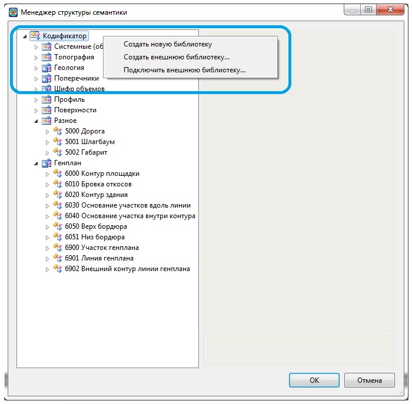
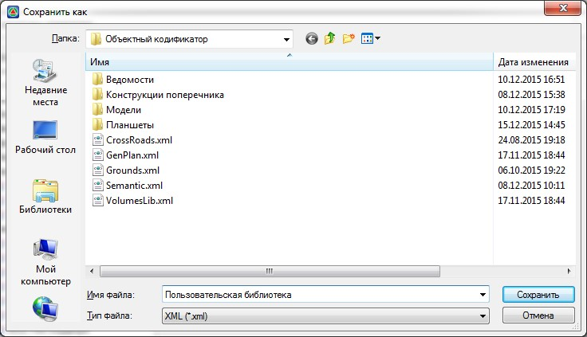
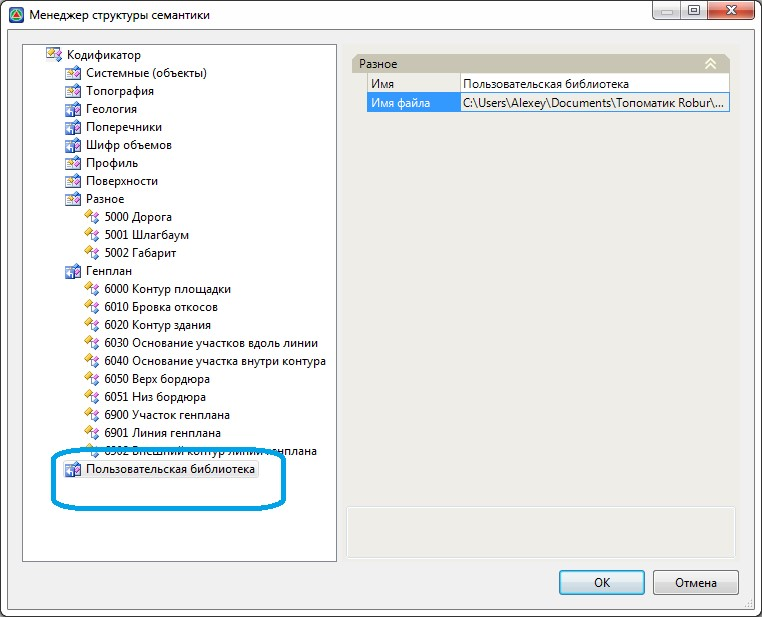

# Создание новой библиотеки

В программе имеется возможность создавать новые библиотеки и семантические объекты, а также редактировать имеющиеся данные (кроме семантических объектов библиотеки Генплан).

Для этого:

1. Выберите меню **Сервис – Менеджер структуры семантики**, откроется диалоговое окно:

   

2. Для создания новой **Библиотеки** нажмите правой кнопкой мыши на самом верхнем названии **Кодификатор**, откроется контекстное меню:

   

   Опция **Создать новую библиотеку** позволяет создать новую библиотеку в основном файле Semantic.xml.

   Опция **Создать внешнюю библиотеку** позволяет создать новую подключаемую библиотеку в качестве отдельного xml файла, указав путь сохранения xml файла.

   

   Все добавляемые пользовательские библиотеки рекомендуется создавать в качестве внешних библиотек, которые при необходимости всегда могут быть подключены к любому проекту.

   

   Опция **Подключить внешнюю библиотеку** позволяет к менеджеру структуры семантики (объектному кодификатору) подключить ранее созданную или сохраненную библиотеку.

3. Выберите опцию **Создать внешнюю библиотеку**. В открывшемся окне укажите название и место сохранения библиотеки:

   

   Нажмите **Сохранить**. В результате будет создана и автоматически подключена к Объектному кодификатору новая библиотека:

   