# Создание новых семантических объектов

Имеется возможность создания пользовательских объектов семантики. Новые объекты могут быть добавлены в имеющиеся библиотеки (кроме библиотеки Генплан) или во вновь созданные.

Ниже, для примера, рассмотрим добавление нового объекта семантики в созданную пользовательскую библиотеку на предыдущем этапе (см. выше).

Для добавления новых семантических объектов:

1. Нажмите правой кнопкой мыши на **Пользовательской библиотеке**, выберите опцию **Добавить новый код**:

   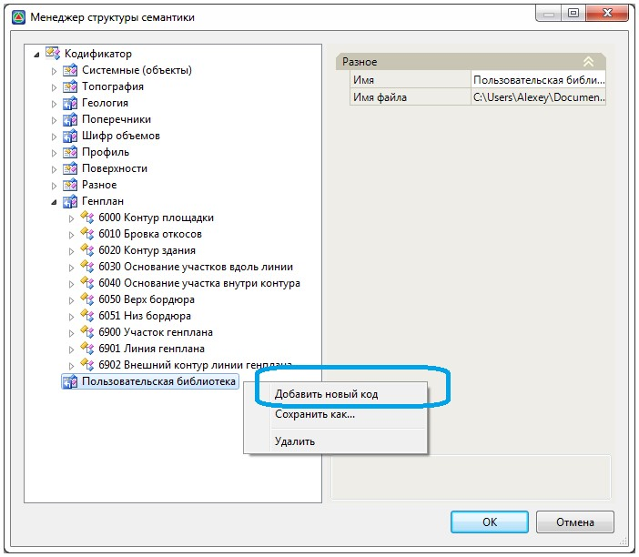

   В результате будет добавлен новый код, которому, по умолчанию, будут присвоены основные параметры:

   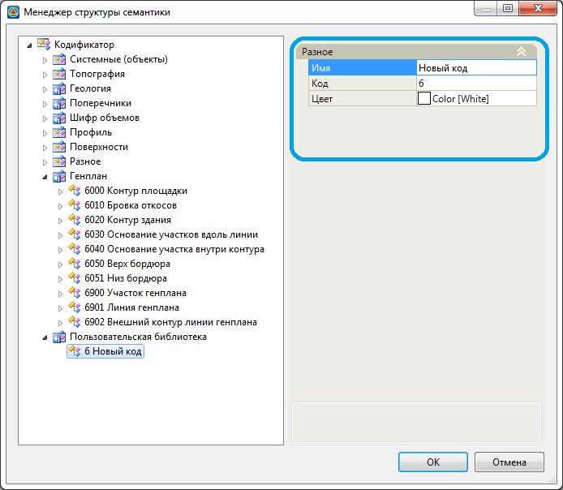

   **Имя, Код** – параметры, определяющие буквенное и цифровое название нового кода в объектном кодификаторе.

   **Цвет** – параметр, определяющий цвет, который будет присвоен элементу проекта (точке, структурной линии, участку и т.д.), которому будет назначен данный семантический объект.

2. Для семантического объекта может быть добавлен определенный набор свойств. Он будет зависеть от того для каких целей и какому элементу проекта в дальнейшем будет назначаться создаваемый семантический объект.

   

   Например, если создаваемый семантический объект, в дальнейшем, будет назначаться только структурной линии для того чтобы присвоить ей необходимый код и цвет, то дополнительных свойств, кроме основных (имя, код и цвет) задавать больше не нужно. Если, например, необходимо чтобы структурная линия рисовалась еще и линейным условным знаком на плане, то для этого необходимо добавить соответствующее свойство – **Линейный условный знак**. Ниже подробно будут описаны все свойства, которые могут быть добавлены для семантического объекта.

   

3. Нажмите правой кнопкой мыши на добавленном семантическом объекте, откроется контекстное меню, содержащее полный список свойств, которые могут быть присвоены объекту:

   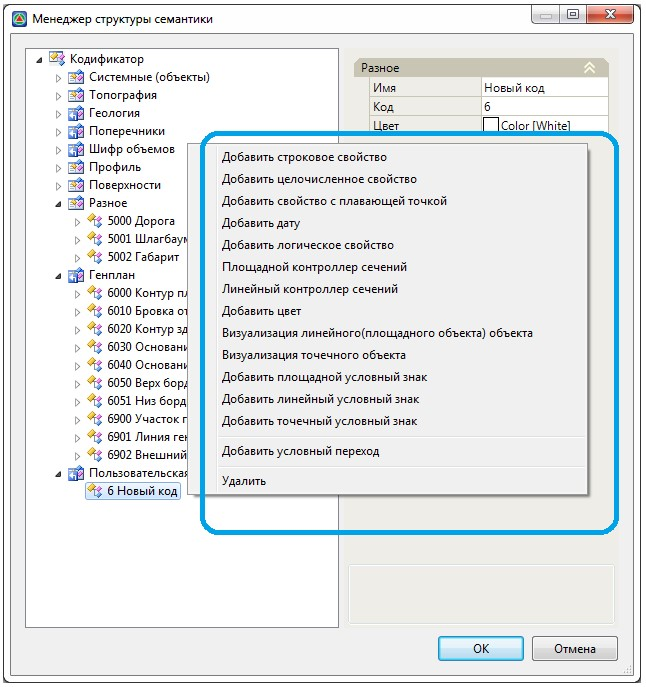

* **Строковое свойство** – данная опция добавляет свойство (поле ввода), которое может содержать любые символы, т.е. как текстовые, так и цифровые значения. Данное поле ввода может использоваться для указания любой пояснительной информации к условному знаку, например материал коммуникации (сталь, жб., бетон), номер здания (№\_14/3А), назначение скважины (бур., развед. и т.д.), номер опоры (54-11) и т.д.

  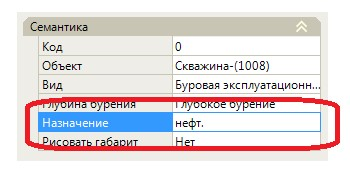

* **Целочисленное свойство** - данная опция добавляет свойство (поле ввода), которое может содержать только целочисленные значения. Ввод любых других значений в данное поле будет игнорироваться. Данное поле ввода удобно использовать для указания характеристик объекта, которые имеют целочисленные значения, например, количество проводов (3), прокладок (2), количество этажей здания (12) и т.д.

  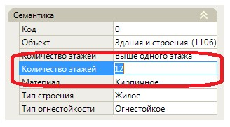

* **Свойство с плавающей точкой** - данная опция добавляет свойство (поле ввода), которое может содержать только дробные значения. Данное поле ввода удобно использовать для указания характеристик объекта, которые имеют дробные значения, например отметка репера, (123,35), высота опоры (6,3), диаметр трубы (0,7) и т.д.

  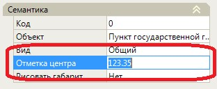

* **Добавить дату** – данная опция добавляет свойство, которое позволяет установить текущую или любую другую дату, путем выбора ее из «календаря», например «17 дек. 2015 г.». 

  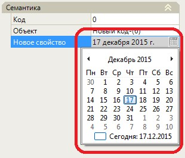

* **Логическое свойство** – данная опция зарезервирована для дальнейших разработок.
* **Площадной контроллер сечений** – добавление данного свойства объекту семантики позволяет в сечениях (профиль, поперечник) отобразить контур площадного объекта заданной высоты. Т.е. данное свойство может быть добавлено, например, для объектов типа – Здания и сооружения.

  Для этого:

  Выберите опцию **Добавить площадной контроллер сечений**, откроется диалоговое окно:

  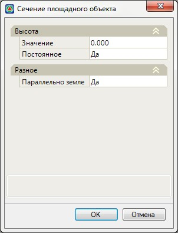

  Значение высоты объекта сечения может быть задано как фиксированное (постоянное), так и переменное значение.

  

  Подробное описание работы переменных будет описано [ниже](identifier_property.md) в соответствующем разделе.

  

  В поле **Разное** задайте способ отрисовки сечения.

  В результате контур сечения отобразится на сечениях, в окне **Профиль** и **Поперечник**.

  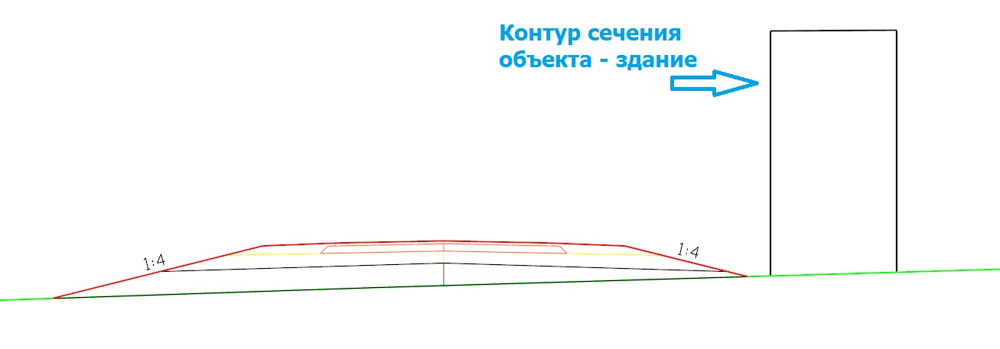

* **Линейный контроллер сечений** - добавление данного свойства объекту семантики позволяет в сечениях (в профиле и поперечниках) отобразить линейный объект условным знаком. Т.е. данное свойство может быть добавлено, например, для объектов типа коммуникации.

  Для этого:

  1. Выберите опцию **Добавить линейный контроллер сечений**, откроется диалоговое окно:

     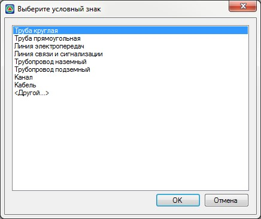

     Так как каждый тип коммуникации в сечениях изображается различными условными знаками, имеют отличия в расположении и содержимом пояснительных надписей, то предусмотрены наборы параметров (заготовки) для разных типов коммуникаций.

  2. Выберите необходимый тип или **Другой** и нажмите **Ок**. Откроется диалоговое окно:

     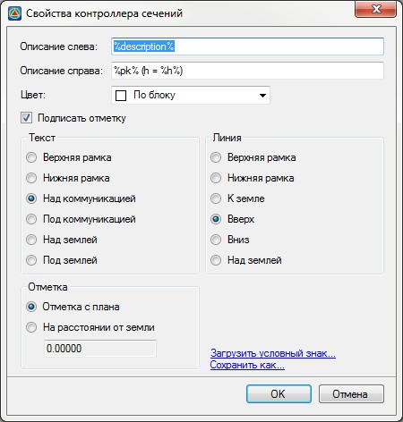

     Все параметры изображены на схеме:

     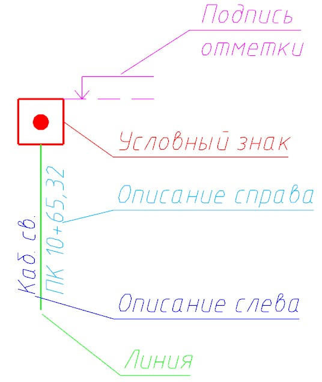

     **Описание слева** – текстовое поле, которое содержит описание коммуникации и располагается слева от линии.

     **Описание справа** – текстовое поле, которое содержит описание коммуникации и располагается справа от линии.

     

     В описании коммуникации могут использоваться различные фиксированные текстовые надписи (Кабель св., Эл. каб. и т.д), также подпись может быть сформирована из стандартных свойств (пикет, отметка, смещение и т.д.) или пользовательских свойств (описание, тип коммуникации, диаметр, провис и т.д.). Ниже в соответствующем разделе будет подробное описание их использования. 

     

     **Цвет** – задается цвет **Отметке, Линии** и **Текстовым описаниям** коммуникации.

     В поле **Текст** выбирается один из вариантов расположения **Текстового описания**.

     В поле **Линия** выбирается один из вариантов расположения **Линии**.

     В поле **Отметка** задается способ отрисовки коммуникации. Т.е. коммуникация может рисоваться на заданной абсолютной отметке, для этого включите опцию **Отметка с плана**, либо в случае если «ножка» (линия) коммуникации имеется фиксированную длину, то в поле **На расстоянии от земли** задайте необходимую величину «ножки» (линии) в мм.

  3. Задайте необходимые параметры и нажмите **ОК**.

 

* **Добавить цвет** – данная опция добавляет свойство **Цвет**.

  

  Свойство **Цвет** на данный момент не используется. Реализовано для использования в дальнейших разработках.

  

* **Добавить Точечный, Линейный и Площадной условные знаки** – выберите необходимое свойство для присвоения объекту условного знака из соответствующей библиотеки.
* **Визуализация точечного объекта** – данное свойство позволяет отобразить точечный объект на визуализации в качестве 3D объекта, выбрав необходимый 3D объект из библиотеки. В открывшемся окне задайте основные параметры объекта и нажмите Ок.
* **Визуализация линейного (площадного) объекта** - данное свойство позволяет отобразить линейный (площадной) объект на визуализации в качестве 3D объекта. Для этого в программе имеется специальный инструментарий, с помощью которого можно моделировать (создавать) различные 3D объекты, например здание, деревья, водоемы, коммуникации и т.д.

  Для этого:

  1. Выберите опцию **Линейный (площадной) контроллер визуализации**, в открывшемся окне **Создания линейного (площадного) 3D объекта** нажмите правой кнопкой мыши в верхней области окна, откроется список имеющегося инструментария для создания 3D объектов:

     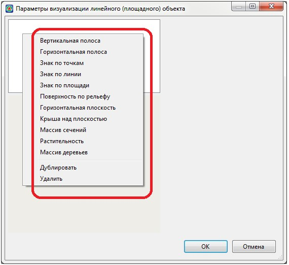

     **Вертикальная полоса** – элемент, с помощью которого моделируется (создается) вертикальная полоса заданной высоты с возможность наложения текстуры. С помощью данного элемента можно моделировать, например стену здания, забор и т.д. 

     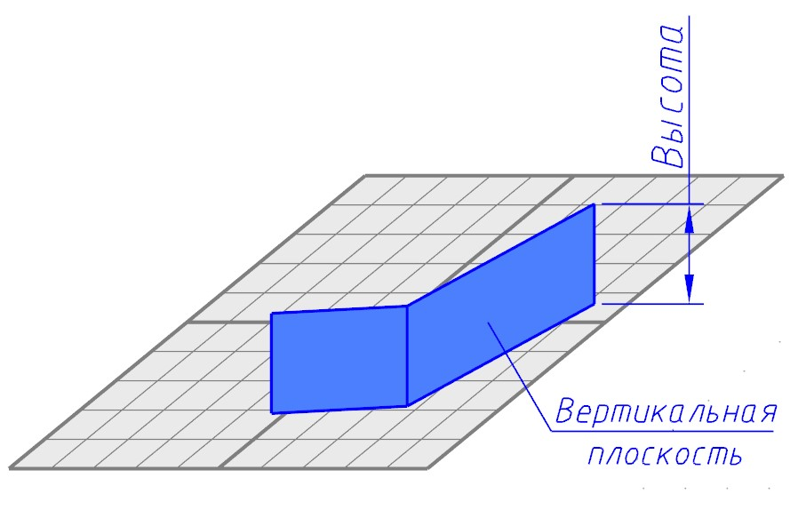

     **Горизонтальная полоса** - элемент, с помощью которого моделируется (создается) горизонтальная полоса заданной ширины. С помощью данного элемента можно моделировать, например велосипедные или пешеходные дорожки. 

     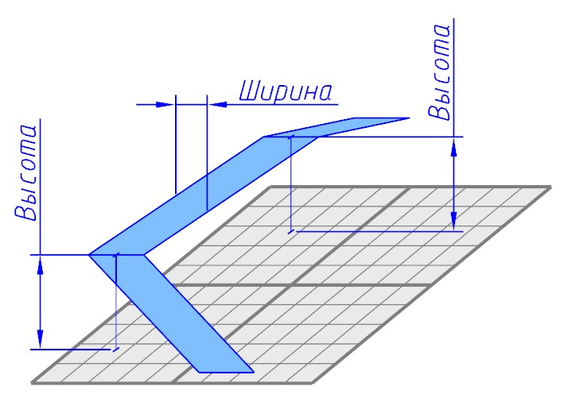

     **Знак по точкам** – элемент, с помощью которого имеется возможность в узлах структурной линии вставлять 3D объект. Данный элемент может использоваться для расстановки опор коммуникации, столбов освещения и т.д в узлах линейного объекта.

     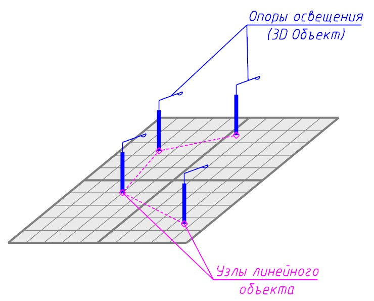

     **Знак по линии** – элемент, с помощью которого имеется возможность расставить 3D объекты вдоль линии. Данный элемент может использоваться для вставки опор коммуникации, столбов освещения и т.д, которые расставляются вдоль линии с заданным расстоянием между 3D объектами.

     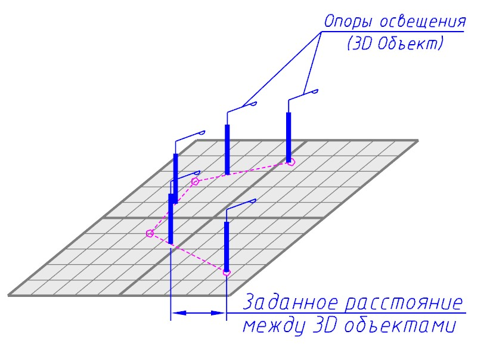

     **Знак по площади** - элемент, с помощью которого имеется возможность расставить 3D объекты внутри замкнутого площадного объекта. Данный элемент может использоваться при моделировании леса, пастбища и т.д. 

     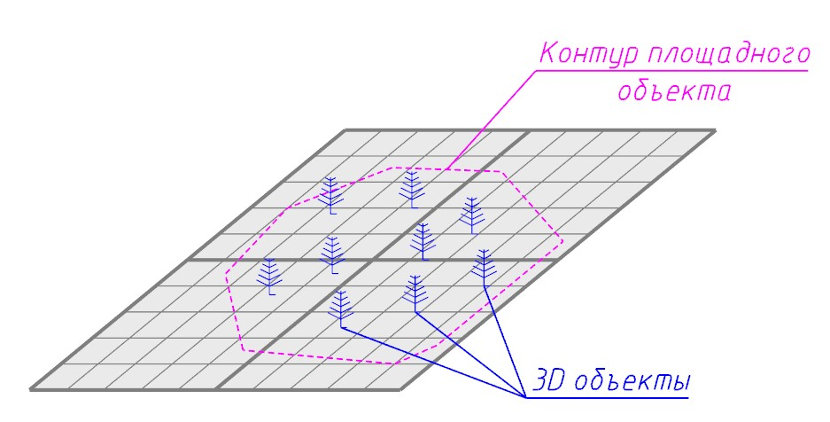

     **Поверхность по рельефу** – элемент, с помощью которого имеется возможность для контура площадного объекта (полигона, участка) задать текстуру, которая будет «наложена» на поверхность. Имеется возможность использования **3D** текстур в формате **\*dds** (**DirectDraw Surface**), с возможностью задания уровней рельефности и блеска (световых отражений). Данный элемент может использоваться для реалистичного моделирования рельефных поверхностей асфальта, обочины, тротуаров и т.д.

     **Горизонтальная плоскость** – элемент, с помощью которого имеется возможность моделировать горизонтальную плоскость на заданном уровне (высоте) с возможностью наложения на нее текстуры.

     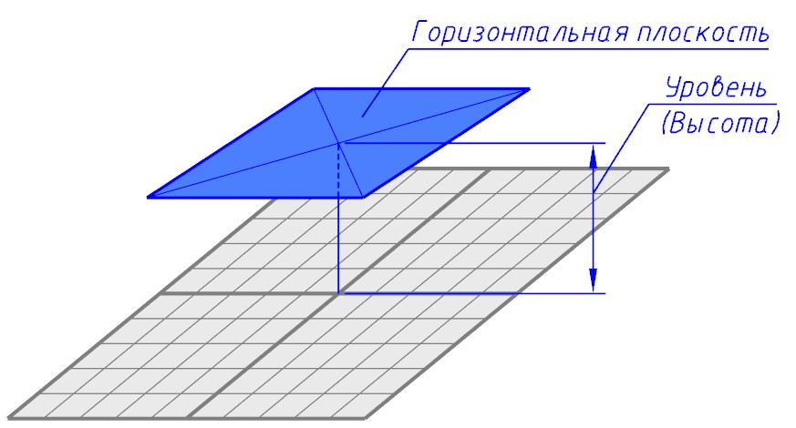

     

     Назначается для площадного объекта (полигона, участка)

     

     **Крыша над поверхностью** – элемент, который предназначен для моделирования крыши здания. Данный элемент используется преимущественно для моделирования двускатных крыш.

     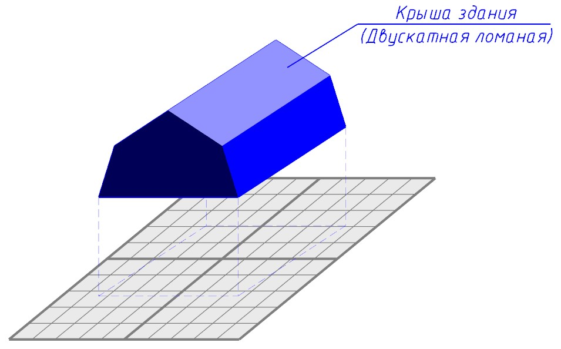

     **Массив сечений** – элемент, который предназначен для моделирования различных линейных объектов (коммуникаций), которые в любом месте сечения имеют одинаковую геометрию. Причем геометрия сечений линейных объектов может быть произвольной, т.е., например, треугольная, круглая, квадратная и т.д. Данный элемент может использоваться для моделирования различного типа линейных моделей, например трубопроводов, кабелей, проводов, рельсов и т.д. 

     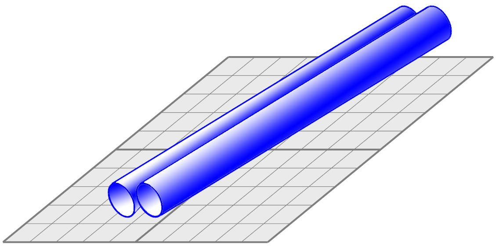

      Доступные сечения объектов можно выбрать в селекторе **Модель**:

     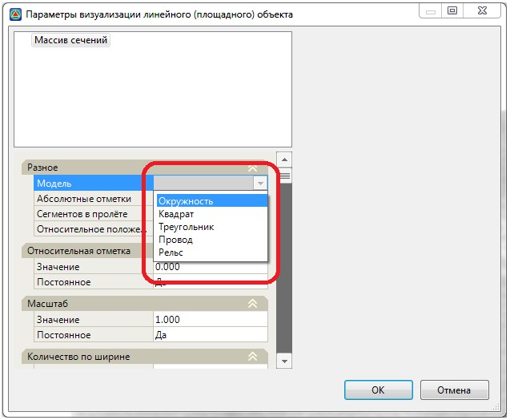

     Список и параметры сечений программа «читает» из файла `standard.crs`, который представляет собой текстовый файл, находящийся по пути `C:\ProgramData\Topomatic\Visualization\2.0\Sections` и представляет следующий вид:

     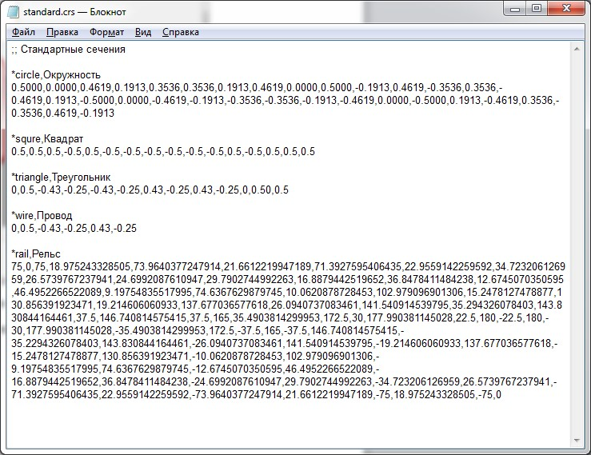

     Каждая характерная точка сечения определяется математическими координатами X и Y.

  **Растительность** – элемент, который предназначен для реалистичного моделирования растительности, преимущественно травяного покрова. 

  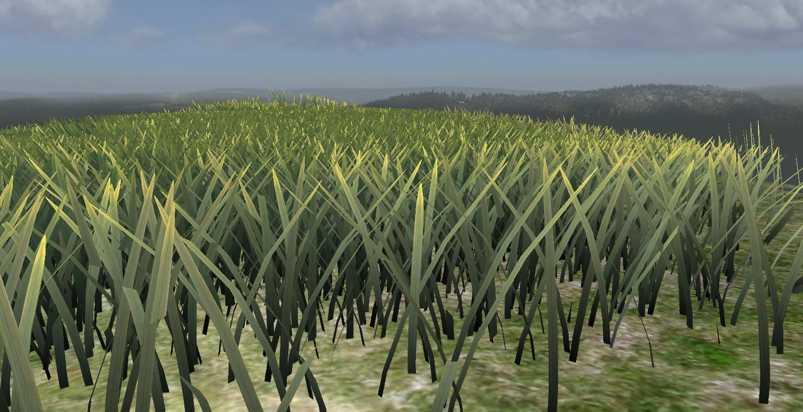

  **Массив деревьев** – элемент, который предназначен для реалистичного моделирования различных видов деревьев.

  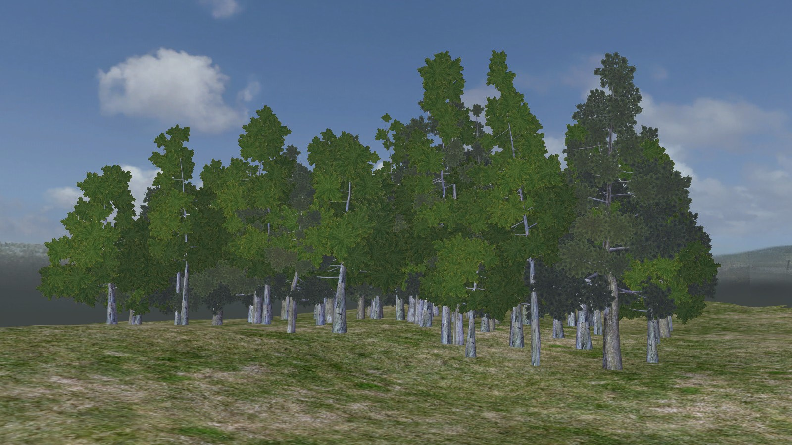

  Доступные породы деревьев выбираются в раскрывающемся списке **Модель**:

  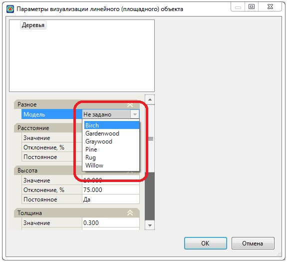

* **Добавить условный переход** – данная опция позволяет создать раскрывающийся список, в котором можно добавить необходимое количество опций. Используется в тех случаях, когда у семантического объекта имеется, например, несколько типов материалов, видов условных знаков или любых других свойств.

  Например, для объекта **Опора** имеется раскрывающийся список, в котором можно выбрать материал опоры (Деревянная, Металлическая, Железобетонная), в результате изменения материала меняется условный знак.

* **Удалить** – выберите данную опцию для удаления добавленного свойства.