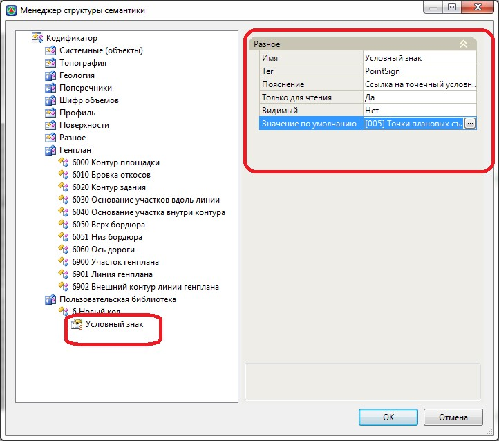

# Редактирование семантических свойств

Имеется возможность редактировать добавленные семантические свойства.

Для этого:

1. Выделите необходимое свойство, в правой части окна отобразятся основные параметры выбранного элемента:

   

   **Имя** – задается название свойства.

   **Тэг** – это идентификатор (определение) свойства, который позволяет программе определить значение этого свойства.

   

   Подробнее о Тэгах см. в соответствующем разделе [ниже](identifier_property.md).

   

   **Пояснение** – задается пояснение для заданного Тэга.

   **Только для чтения** – имеется возможность выбранное свойство сделать редактируемым или только для чтения.

   **Видимый** – имеется возможность показать или скрыть свойство.

   **Значение по умолчанию** – поле ввода для присвоения выбранному семантическому свойству значения по умолчанию. Для этого введите необходимое значение либо, выделив поле Значение по умолчанию, нажмите кнопку .

2. Задайте необходимые параметры и нажмите **Готово**.