# Идентификаторы свойств. Теги.

Практически каждый семантический объект имеет набор присвоенных свойств (текстовых подписей (тип коммуникации, материал и т.д.), различных числовых характеристик (диаметр, количество) и т.д.). Для того чтобы значения этих свойств можно было использовать в различном функционале, например для отображения подписи на плане, а также формировать новые семантические свойства из совокупности других свойств (например подпись характеристик коммуникации на сечениях) необходимо использовать идентификатор (определение) свойств – **Тэги**. Т.е. при наличии у **Семантического свойства идентификатора** (Тэга) появляется возможность использовать значение этого **Свойства**, ссылаясь на него в любых других **Свойствах**, или например, при добавлении атрибута к условному знаку.

## Список идентификаторов (Тегов) стандартных свойств элементов проекта. Пример использования.

У некоторых элементов проекта (Точка поверхности, Структурные линии) уже имеется стандартный набор свойств. У каждого стандартного свойства имеется свой идентификатор (Тэг).

Ниже приведена таблица, в которой приведен список стандартных свойств и соответствующие им идентификаторы (Тэги):

| № п\п | Наименование Свойства элемента | Название идентификатора (Тэга) |
| --- | --- | --- |
| 1 | Положение X | X |
| 2 | Положение Y | Y |
| 3 | Положение Z | Z |
| 4 | Номер | NUMBER или NUM |
| 5 | Код | CODE |
| 6 | Описание | DESCRIPTION |

### Пример использования идентификаторов (Тегов) стандартных свойств

Например, необходимо точечному условному знаку **«1003 Столб закрепления проекта планировки»** добавить отображение отметки, причем ее значение необходимо получить автоматически из свойств элемента **Точка поверхности**.

Для этого:

1. Назначьте соответствующий семантический объект (подробно назначение см. соотв. пункт ниже), «1003 Столб закрепления проекта планировки», отобразится условный знак:

   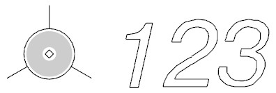

2. Выделите условный знак, нажмите правой кнопкой мыши, в контекстном меню выберите Редактировать атрибуты, откроется диалоговое окно:

   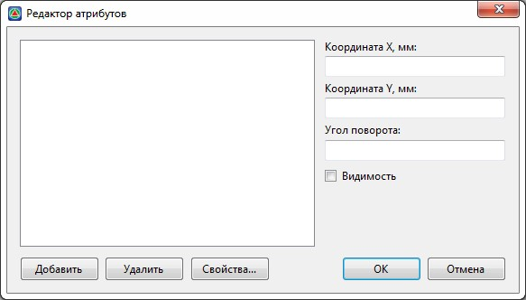

   * **Добавить** – для добавления нового атрибута
   * **Удалить** – для удаления выделенного атрибута
   * **Свойства** – для изменения свойств добавленных атрибутов
   * **Координата Х, Y, Угол поворота, Видимость** – для позиционирования атрибута относительно условного знака и управление видимостью.

3. Нажмите кнопку **Добавить**, откроется диалоговое окно:

   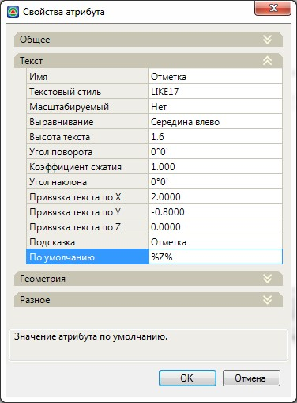

   Для того чтобы из свойств точечного объекта получить значение высотного положения (отметку Z), в поле По умолчанию необходимо записать соответствующий идентификатор (Тег), который будет заключен с двух сторон символом процент, т.е. `%Z%`.

   

   Параметры атрибутов описаны в [п. Задание атрибутов](../../rb_survey/dtm/dwg/assignment_attributes.md).

   

4. В окне **Добавления и Редактирования атрибутов** нажмите **Ок**, в результате, с заданными параметрами положения атрибута относительно условного знака будет отображаться добавленный атрибут. 

   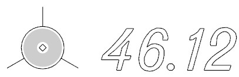

### Присвоение идентификаторов свойствам семантических объектов. Пример использования.

Любому из имеющихся семантических свойств можно присвоить идентификатор.

Для этого:

1. Выберите меню **Сервис – Менеджер структуры семантики**, в открывшемся окне **Объектного кодификатора** выделите необходимое семантическое свойство объекта:

   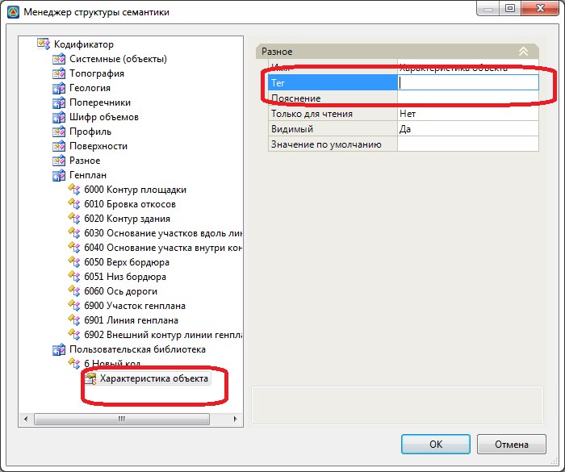

   В текстовое поле **Тег** необходимо ввести **Идентификатор**.

   Идентификаторы (Тэги) свойств могут быть двух видов – **Программные** и **Пользовательские**.

   **Пользовательские идентификаторы** представляют собой любой набор символов латинского алфавита без пробелов, например **DISTANCE, MATERIAL** и т.д.

   **Программные идентификаторы** представляют собой определенный набор символов латинского алфавита.

   При назначении элементу проекта семантического объекта, у которого имеются свойства с программными идентификаторами (Тэгами), имеется возможность учитывать данные семантические объекты в различном программном функционале. Например, возможность учитывать объекты (точечные, линейные и площадные) при расчете 3D видимости или отображения габаритного расстояния от объекта до трассы.

   К таким Тэгам относятся:

   **PlanGabarit** – данный Тэг позволяет рассчитывать расстояние от точечного объекта до подобъектов трасс, с возможностью задания и графического отображения габаритного расстояния. 

   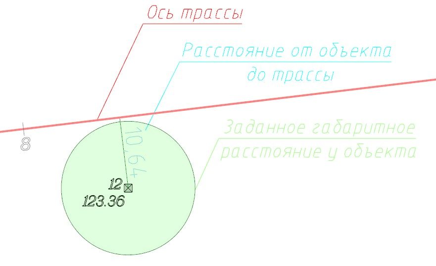

   

   В случае если габаритное расстояние от габарита до оси трассы выдерживается, то круг раскрашивается зеленым цветом, если нет, то красным.

   

   Данный идентификатор имеется, например, у объекта **«5003 Габарит»**:

   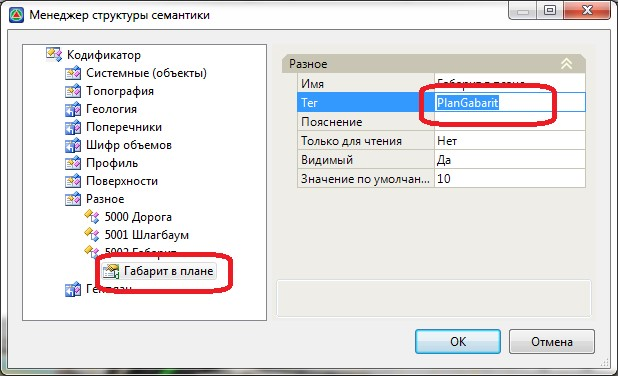

   **WIDTH и HEIGHT** – данные Тэги позволяют задать геометрические параметры (Высоту и Ширину) объекта, для учета его при расчете 3D видимости.

   Данный идентификатор имеется, например, у объекта **«1040 Полоса древесных насаждений»**

   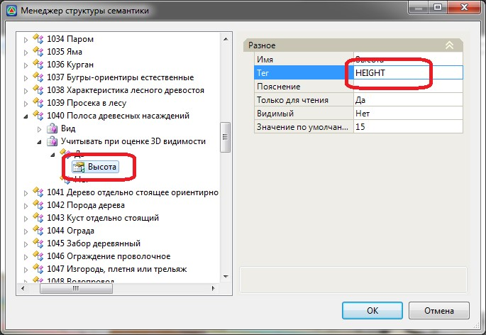

2. В поле **Тег** введите идентификатор свойства. В результате данному свойству будет присвоен идентификатор, с помощью которого имеется возможность использовать значение этого свойства.

### Пример использования пользовательских идентификаторов

Рассмотрим назначение и варианты использования пользовательского идентификатора для добавленного семантического свойства.

Для этого:

1. Откройте **Менеджер структуры семантики**, в открывшемся окне **Объектного кодификатора** выделите необходимое семантическое свойство объекта, и в правой части окна задайте параметры согласно рисунку ниже:

   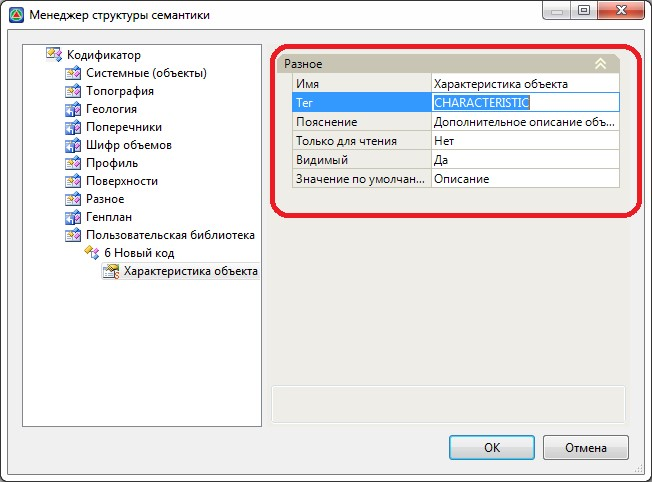

2. Задав имя **Тэга**, не обязательное **Пояснение** и **Значение по умолчанию**. В результате семантическому свойству «Характеристика объекта» будет присвоен идентификатор с помощью которого имеется возможность «извлечь» значение этого свойства, которое в дальнейшем может быть использовано для отображения его на плане, сечениях или в другом программном функционале.

3. Зададим точечный условный знак для объекта путем создания соответствующего свойства и выбора знака из библиотеки точечных условных знаков. Для примера выбран условный знак **Километрового столба**:

   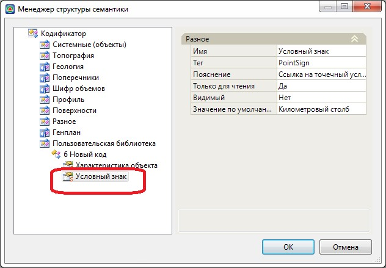



Подробно см. [п. Создание новых семантических объектов, Добавление точечного условного знака](create_new_objects.md).



### Пример использования идентификатора для отрисовки значения свойства на плане:

1. Назначьте созданный семантический объект «6 Новый код» для элемента проекта **Точка поверхности**.

   

   Назначение семантических объектов см. ниже.

   

2. В результате в окне **Свойств** выделенного объекта в поле **Семантика** отобразится назначенный объект и добавленное свойство «Характеристика объекта» со значением по умолчанию:

   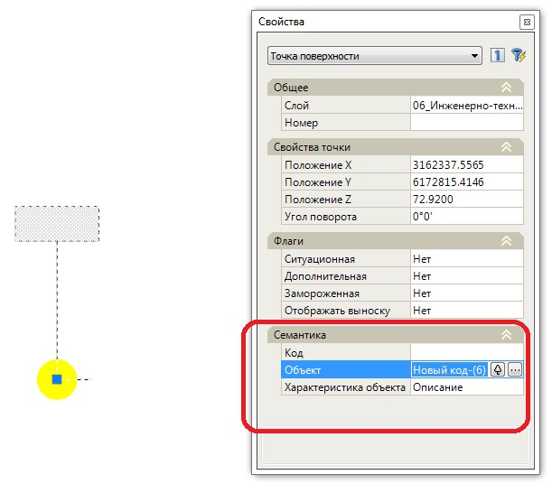

3. Для отрисовки значения свойства на плане необходимо в окне Редактирования атрибутов добавить новый атрибут, задать необходимые параметры отрисовки и задать значение по умолчанию «%CHARACTERISTIC%»:

   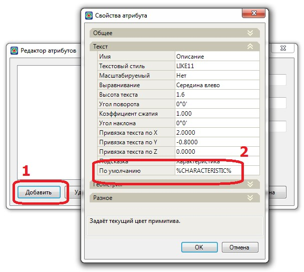

   

   Добавление атрибутов см.выше.

   

4. В окне **Добавления и Редактирования атрибутов** нажмите **ОК**. В результате введенное значение в поле свойства «Характеристика объекта» будет отображено на плане:

   

### Пример использования идентификатора в других функциях, в частности для отображения подписи в условном знаке сечения линейного объекта (т.е. в линейном контроллере сечений):

Для этого:

1. Откройте **Менеджер структуры семантики**, в открывшемся окне **Объектного кодификатора** для семантического объекта «6 Новый код» добавим свойство **Линейный контроллер сечений**, откроется диалоговое окно:

   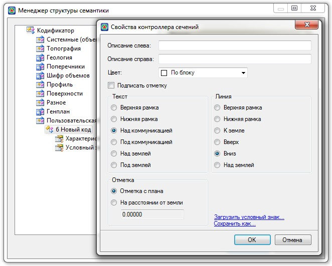

   

   Добавление свойства **Линейный контроллер сечений** см. раздел выше.

   

2. В открывшемся окне **Свойств** контроллера сечений установим необходимые параметры условного знака коммуникации (**Текст, Линия, Цвет, Отметка, Условный знак**), а также в поле **Описание слева или справа** введем необходимый идентификатор свойства (в данном случае **%CHARACTERISTIC%**), значение которого необходимо отрисовать с необходимой стороны условного знака:

   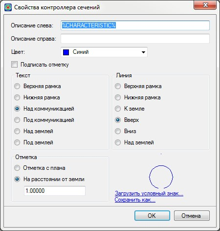

3. В окне **Свойств** контроллера сечений и **Менеджере структуры семантики** нажмите **ОК**.

4. Назначьте семантический объект «6 Новый код» для элемента проекта **Структурная линия**, которая пересекает ось трассы, и задайте необходимое описание в свойстве **Характеристика объекта**:

   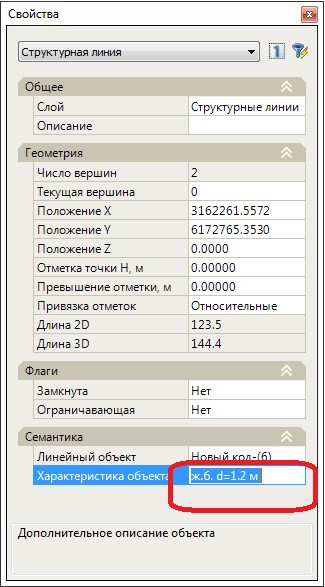

В результате отобразится условный знак и введенная характеристика объекта:

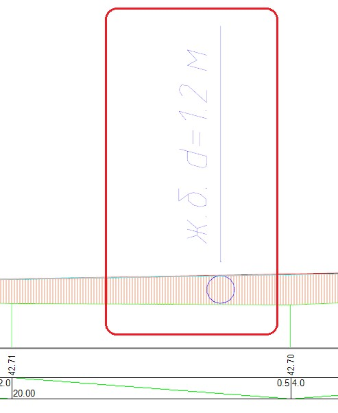
