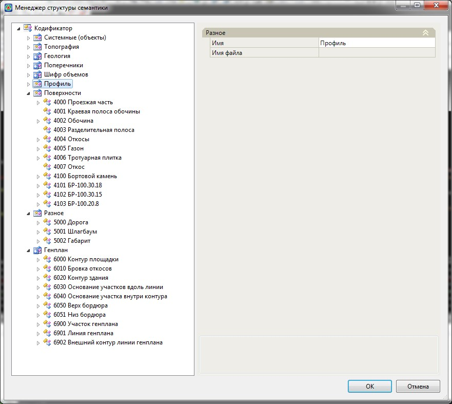
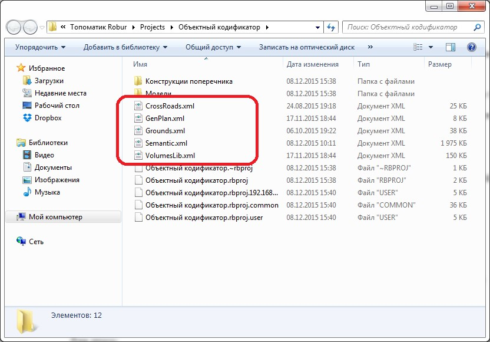

# Менеджер структуры семантики (Объектный кодификатор).

Все имеющиеся семантические объекты хранятся в **Менеджере структуры семантики**.

Для того чтобы открыть **Объектный кодификатор**:

1. Выберите меню **Сервис – Менеджер структуры семантики**:

   

**Менеджер структуры семантики** содержит в себе набор библиотек (Топография, Поперечники, Генплан и т.д.) в которых содержатся семантические объекты с соответствующим набором свойств.

**Объектный кодификатор** состоит из основного файла библиотеки **Semantic.xml** и подключаемых файлов других библиотек.

Те библиотеки, которые отмечены значком  , являются подключаемыми и представляют собой отдельные XML файлы – это файлы: **Генплан** (**GenPlan.xml**), **Поперечник**и (**CrossRoads.xml**), **Геология** (**Grounds.xml**) и **Шифры объемов** (**VolumesLib.xml**).

Те библиотеки, которые отмечены значком  , хранятся в основном файле **Semantic.xml**.

При создании нового проекта,**Библиотеки** копируются из пути `C:\ProgramData\Topomatic\ Robur\15.0\Support в папку создаваемого проекта`