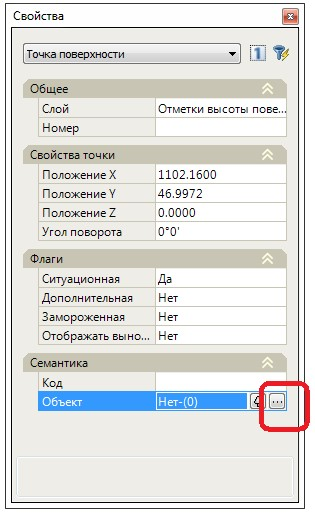
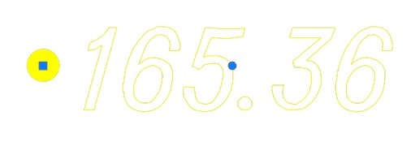
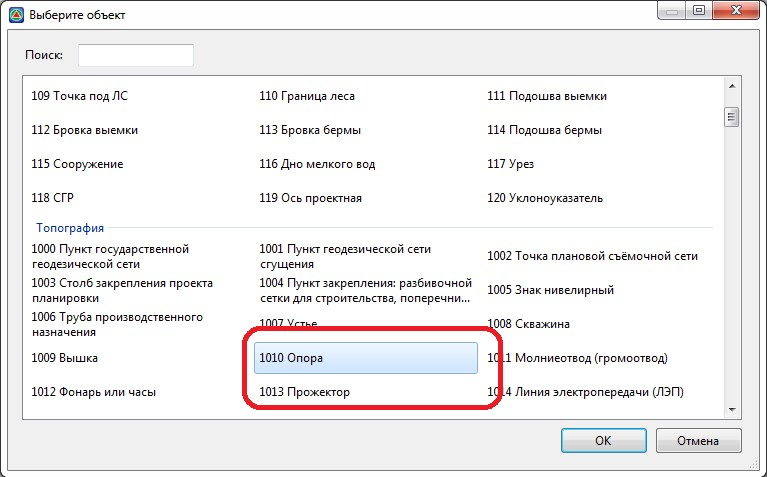
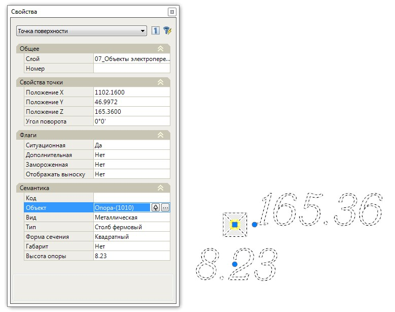

# Назначение объектов семантики для элементов проекта

Имеющиеся объекты семантики назначаются для элементов проекта различного типа. Это могут быть объекты поверхности – **Точки, Структурные линии, Треугольники (группы)**, или элементы конструкций поперечного профиля – **Контуры, Объемы**.

Для того чтобы назначить семантический объект:

1. В окне **Свойств** выбранного объекта нажмите соответствующую кнопку:

   
   

2. В открывшемся окне **Объектного кодификатора** выберите необходимый семантический объект:

   

3. В результате семантический объект будет применен к выбранному элементу проекта:

   