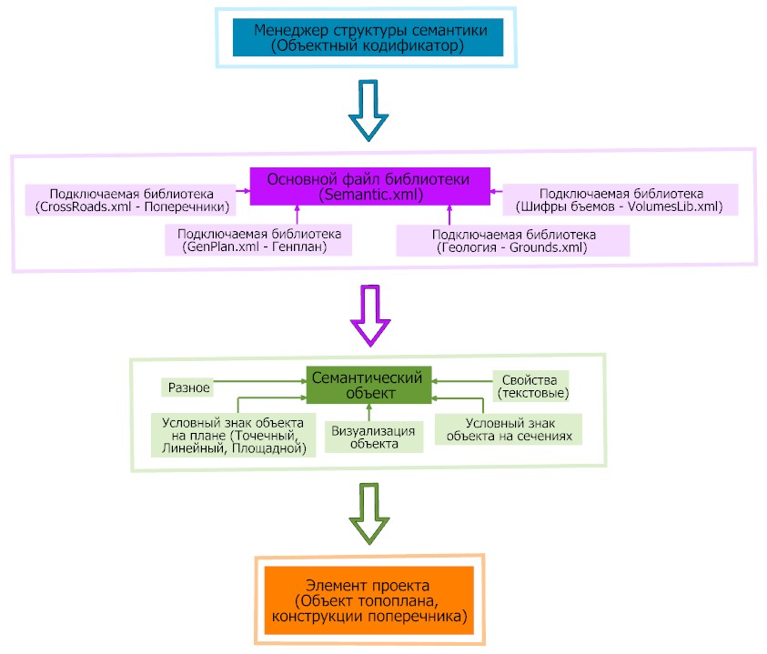

# Семантика. Объектный кодификатор.

В программе имеется возможность некоторым элементам проекта (объекты топографического плана (точки, структурные линии, треугольники), конструкции поперечника (контура и объемы)) присвоить определенные характеристики (семантические свойства), которые могут определять, например, каким условным знаком будет отображен данный объект в окне **План, Профиль** и **Поперечник**, будет ли он отображаться на сечениях, на визуализации, учтен при оценке видимости, выводиться в ведомость объемов и т.д.

Необходимые наборы свойств объединены в семантические объекты, которые по умолчанию, уже созданы в программе для каждого необходимого элемента проекта. Например, если присвоить структурной линии семантический объект **«1014 ЛЭП»**, то в результате, структурная линия будет рисоваться соответствующим условным знаком на плане профиле и поперечниках, а также попадать на сечения и отображаться на визуализации в виде линий электропередачи. Или, например, если в окне **Поперечник**, задать какой – либо конструкции **Объем семантический объект** **«2563 Присыпная обочина»**, то данная конструкция будет раскрашена желтым цветом и ее объем будет вычислен в ведомости объемов в соответствующей графе **Присыпная обочина**.

Ниже представлена схема **Менеджера структуры семантики**:

Понятия, встречающиеся в данном разделе:

1. **Менеджер структуры семантики (объектный кодификатор)** – это полная база семантических объектов имеющихся в программе, объединенных в одну или несколько библиотек по типам объектов, их свойствам или области назначения.
2. **Семантический объект** – это совокупность различных семантических свойств, объединенных в один элемент (объект).
3. **Семантические свойства** – свойства, которые могут быть назначены для семантического объекта, с помощью которых присваиваются различные характеристики или параметры отображения, например, условный знак, описание, характеристики, отображение на визуализации и т.д.
4. **Идентификатор свойства (Тэг)** – это текстовая строка, которая задает уникальное имя семантическому свойству, в результате чего имеется возможность «извлечь» и использовать значение этого свойства в различном программном функционале.
5. **Элементы проекта** – в качестве элементов проекта могут выступать объекты поверхности (Точки, Структурные линии и Участки) и элементы конструкции проектного поперечного профиля (Контура и Объемы).