# Способы подсчета объемов

Программа **Топоматик Robur** позволяет произвести подсчет объемов работ несколькими методами: по поперечникам, между линиями с заданными кодами и по сетке квадратов.

## Расчет объемов поперечникам.

В данном случае подсчет площадей и объемов происходит по имеющимся контурам конструкций на поперечниках, как замкнутым, так и не замкнутым. К примеру, расчет площади планировки, производится как полусумма длин линии на смежных поперечниках, умноженная на расстояние между ними. Расчет объемов производится как полусумма площадей контуров на смежных поперечниках, умноженная на расстояние между ними. Рассчитанные объемы автоматически заносятся в соответствующие ведомости.

Для этого формирования стандартной ведомости объемов работ:

1. Выберите элемент меню: **Проект - Создать ведомость - Площадей и объемов**. Откроется мастер формирования ведомостей.
2. Выберите формат формируемой ведомости и нажмите **Далее**:

   

3. Выберите шаблон формируемой ведомости и нажмите **Далее**:

   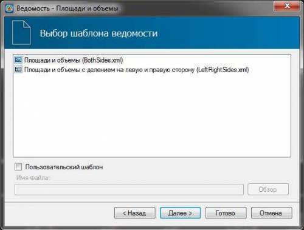

   На данном шаге имеется возможность выбрать один из стандартных шаблонов формируемой ведомости. Объемы могут быть сформированы с разделением на левую и правую сторону или без разделения.

   

   Подробнее о создании и применении пользовательских шаблонов ведомостей будет описано далее в приложении Г [Редактирование динамических выходных ведомостей](../doc/dynamic_vedomosti/edit_vedomosti_and_pattern.md).

   

4. Задайте основные параметры формирования ведомости площадей и объемов и нажмите **Далее**:

   

   В поле **Ведомости** выберите те ведомости, которые необходимо формировать.

   В поле **Тип ведомостей** выберите один из вариантов формирования данных в ведомостях:

   * **По поперечникам** - площади и объемы будут рассчитаны и сформированы в ведомостях по поперечникам.
   * **По пикетам** - площади и объемы будут рассчитаны по поперечникам, а данные в ведомостях будут автоматически сформированы по пикетам.
   * **По километрам** - площади и объемы будут рассчитаны по поперечникам, а данные в ведомостях будут автоматически сформированы по километрам.
   * **Общая** - площади и объемы будут рассчитаны по поперечникам, а данные в ведомостях будут сформированы как по поперечникам, так и автоматически посчитаны по пикетам и километрам.

 

   **Только по выделенным поперечникам** - включение данной опции позволяет произвести подсчет объемов только по помеченным поперечникам.

   

   Подробнее о работе функции **Пометить поперечники** см. в документации [Работа с трассой. Поперечные профили.](../rb_survey/alg/track_crossection/mark_diameters.md)

   

1. При необходимости задайте участок исключаемый из объемов указав пикета начала и конца исключаемого участка и нажмите **Готово**:

   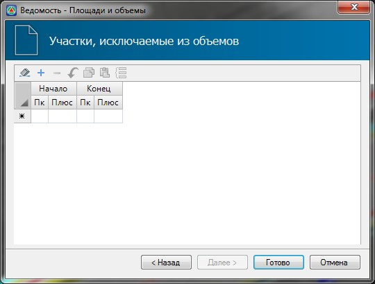

   

   На участках с заданными мостовыми сооружениями (задаются в **Структуре проекта**, таблица **Мосты**) исключение объемов производится автоматически.

   

В результате программа сформирует ведомость объемов и откроет ее в соответствующем редакторе:

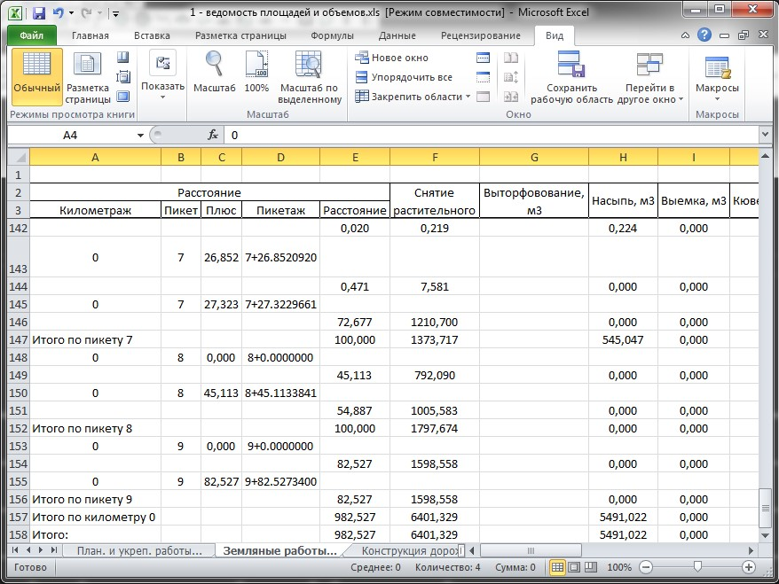



Для проверки и контроля правильности рассчитываемых значений площадей и объемов по поперечникам имеется интерактивный функционал, который включает в себя:

1. Возможность выделения любого конструктивного элемента на поперечнике и отображение его параметров в окне **Свойств**.
2. Вывод значений площади и длины по контуру при наведении на него курсора мыши:
   
   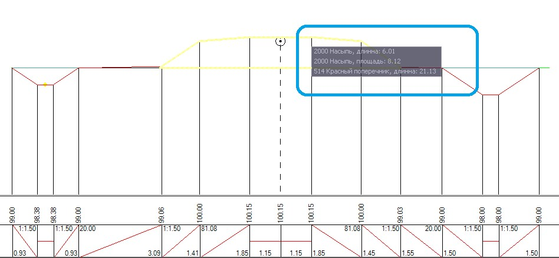

3. Включение\выключение отображения элементов поперечного профиля, а также изменение цвета данных элементов производится с помощью выпадающего списка слоев:

   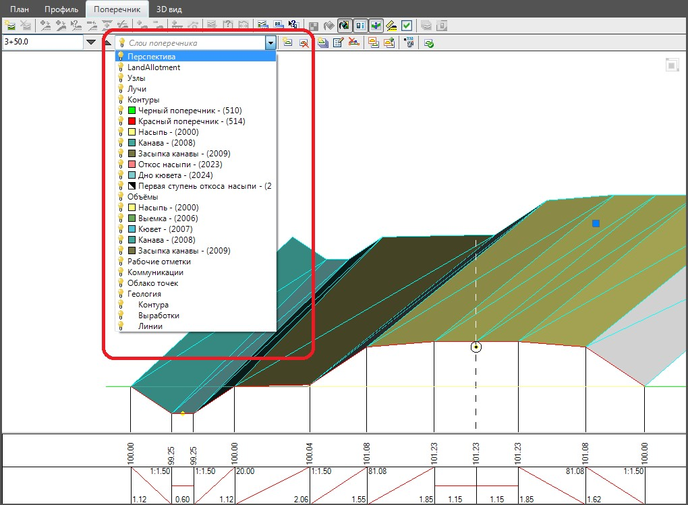



## Расчет объемов между линиями с заданным кодом

Данный метод позволяет произвести расчет площадей и объемов между двумя линиями (не замкнутыми контурами) по поперечникам. Рассчитываемый объем получается в результате выбранных на поперечнике двух линий, в качестве которых могут быть использованы, как линии стандартных конструкций проектного поперечника , так и линии (не замкнутые контура) созданные вручную, с помощью имеющихся инструментов палитры элементов конструкций поперечников, а также добавлением рассекаемых поверхностей на поперечники. Рассчитанные данные формируются в ведомость **Объемы по слоям**.



1. Механизмы создания конструктивных элементов проектного поперечника, в частности создание контуров, описаны в документации [Автомобильные дороги. Проектирование поперечных профилей.](../road/road_crossection/total/general_information.md)
2. Подробнее о **Рассекаемых поверхностях** описано в документации [Автомобильные дороги. Общие сведения.](../road/general_information/setting_subobject.md)



Для этого формирования ведомости объемов между линиями с заданным кодом:

1. Выберите элемент меню: **Проект - Создать ведомость - Объемы по слоям**. Откроется мастер формирования ведомостей.
2. Выберите формат формируемой ведомости и нажмите **Далее**:

   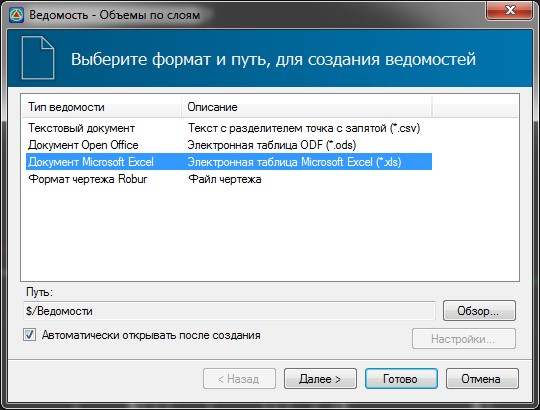

3. На данном шаге задайте имя слоя, код нижней и верхней линии (не замкнутого контура):

   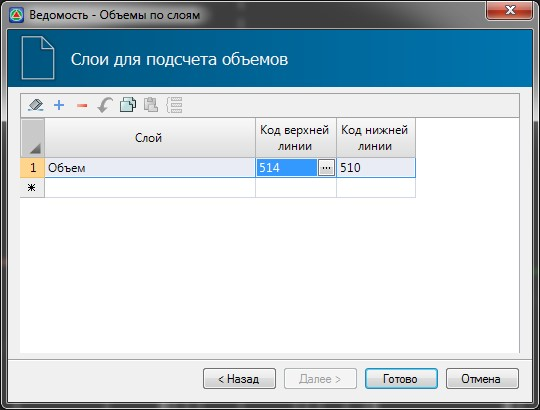

   В столбце **Слой** введите название слоя.

   В столбцах **Код верхней линии** и **Код нижней линии** выберите коды линий на поперечниках, между которыми будет производиться расчет объемов.

   

   1. Для линии (контура) на поперечнике **Код** задается в окне **Свойств выделенного элемента**:

      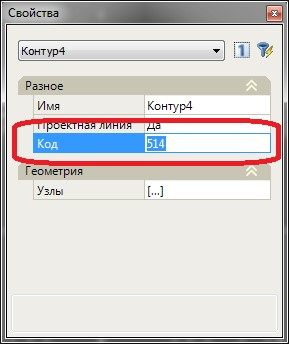

   2. Для поверхностей код назначается в окне Настройки поверхности ,на вкладке **Общие**, в поле **Код поверхности**:

      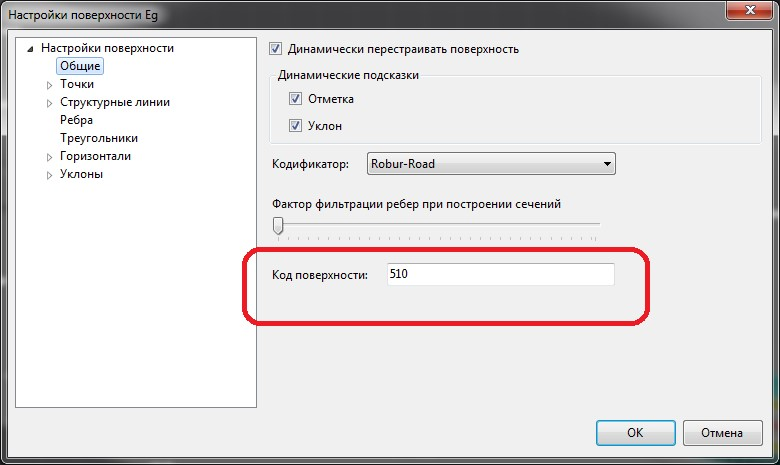



   Расчет площадей и объемов производится между линиями (не замкнутыми контурами) с выбранными кодами. Одна из линий условно считается верхней границей, а вторая – нижней:

   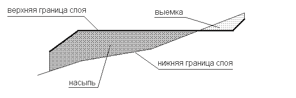

   Для подсчета площадей, область разбивается на элементарные фигуры (трапеции или треугольники). Площадь областей, когда верхняя граница слоя проходит выше нижней, считается насыпью, а другая наоборот – выемкой. Левая и правая границы подсчета площадей определяются концами верхней границы слоя. Нижняя граница продлевается вправо и влево по необходимости:

   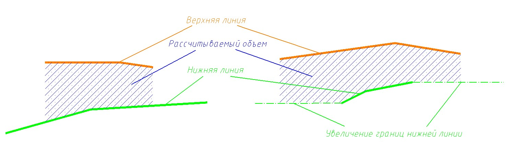

   На левом рисунке верхняя граница слоя короче нижней, которая остается неизменной. а на правом рисунке нижняя граница короче верхней, поэтому к ее крайним левой и правой точкам программа автоматически добавляет горизонтальные сегменты.

4. Нажмите **Готово**. В результате программа сформирует ведомость объемов по слоям и откроет ее в соответствующем редакторе:

   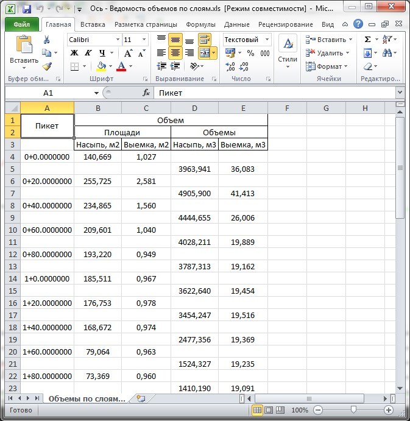

## Расчет объемов по квадратам

Объем между двумя произвольными поверхностями может быть рассчитан по сетке квадратов с помощью картограммы. Подробнее о механизмах подсчета объемов с помощью картограммы можно ознакомиться [здесь.](../commons_tasks/cartogram/create_cartogram.md)
