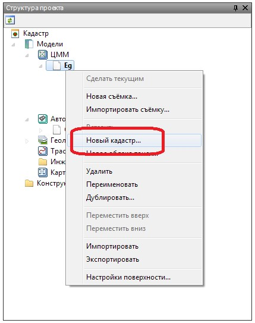

# Загрузка данных

Имеется возможность импорта в программу кадастровых данных. К ним относятся:контуры земельных участков, их номера и площади, сведения о местоположении (регионы, адреса и т.п.).

Импортируемые кадастровые данные отображаются в качестве векторной подложки. Соответственно, имеется возможность привязки к объектам кадастра при выполнении различных построений, управлять их видимостью, а также автоматически формировать на их основе линейные и площадные контуры, необходимые для дальнейшего оформления топографического плана.

Загрузка кадастровых данных осуществляется в модель типа **ЦММ**.

Для этого:

1. В **Структуре проекта** нажмите правой кнопкой мыши на **модели ЦММ**, в открывшемся окне выберите элемент меню **Новый кадастр**:

   

2. В открывшемся окне выберите необходимый **XML -файл**, содержащий кадастровые данные.

В результате, в окне **Структура проекта** у текущей **ЦММ** добавятся дополнительные элементы (кадастровые съемки), а сами кадастровые данные отобразятся в окне **План**:



В одну ЦММ может быть подгружено несколько кадастровых съемок, каждая из своего соответствующего xml-файла.



При выделении какого-либо элемента кадастровой съемки на плане, его информационные характеристики будут отображены в стандартном окне **Свойства**:

