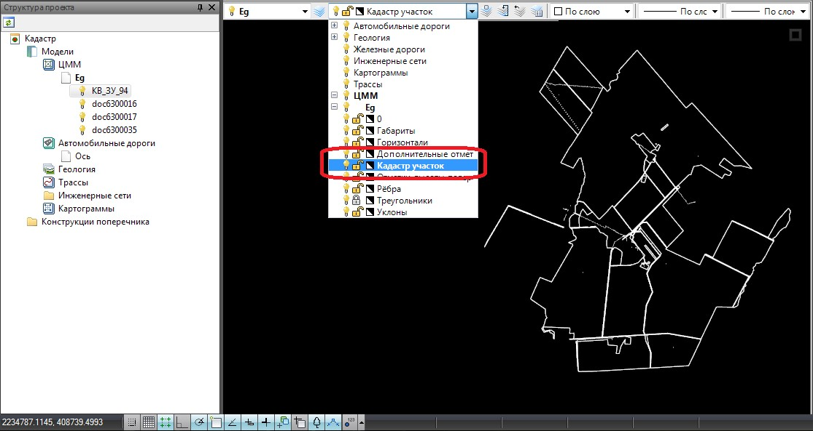
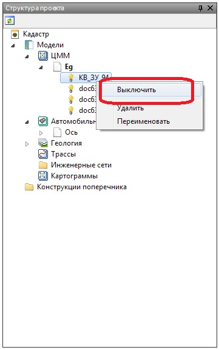
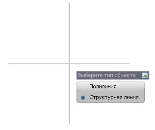
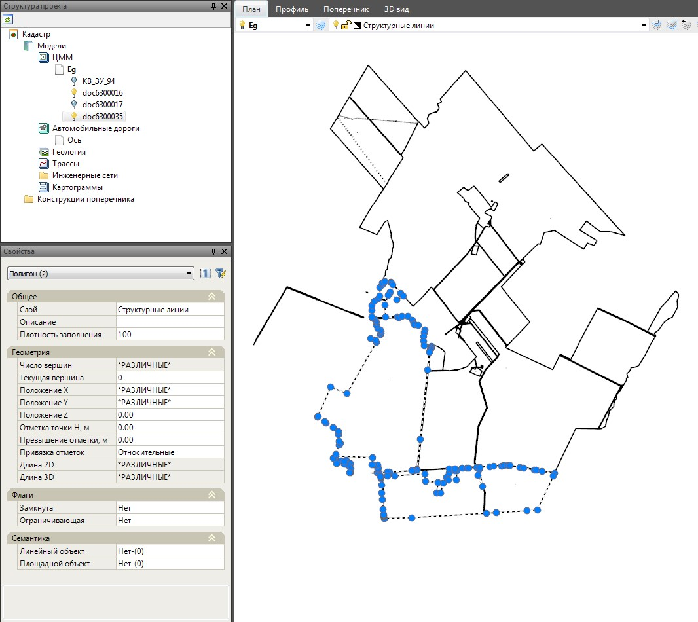

# Работа с кадастровыми данными

## Управление видимостью данных

Для включения\выключения видимости, какого либо слоя кадастровых данных, а также изменения его цвета, воспользуйтесь селектором слоев текущей модели:

Для управления видимостью конкретной кадастровой съемки, в окне **Структура проекта** щелкните правой кнопкой мыши на соответствующем элементе и выберите необходимый пункт меню:

## Формирование контуров по кадастровым данным

По кадастровым данным могут быть созданы контуры, в виде полилиний или структурных линий, для дальнейшего оформления топографического плана.

Для этого:

1. Выберите меню **Задачи – Кадастр – Извлечь контур**, курсор примет форму прицела;
2. Выберите левой кнопкой мыши необходимый контур кадастровой съемки;
3. Укажите тип объекта, который будет создан:

В результате по кадастровому элементу будет сформирован контур в виде структурной линии или полилинии:

