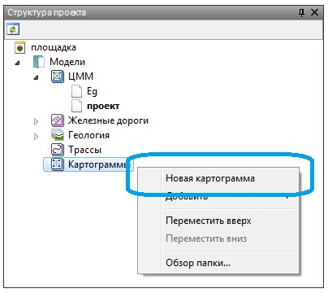
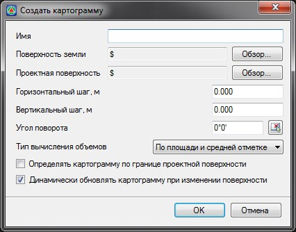
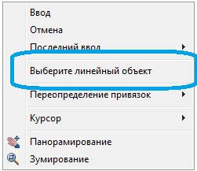
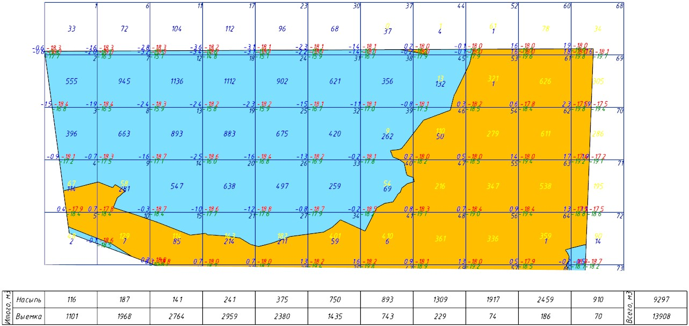
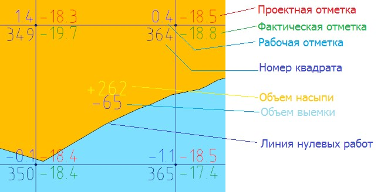
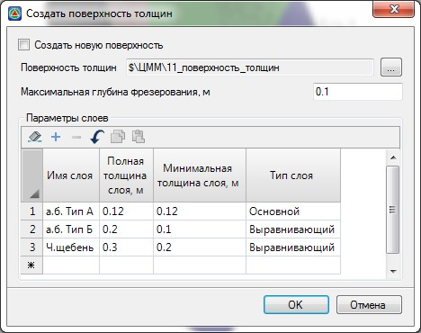
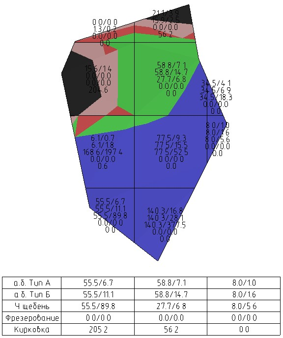

# Создание площадных картограмм

Данный блок функций позволяет производить расчет объемов (насыпи\выемки) между двумя заданными поверхностями, методом разбивки площадного объекта на квадраты определенного размера.

Для создания картограммы:

1. В **Структуре проекта** нажмите правой кнопкой мыши на элементе **Картограммы**:

   

2. Выберите пункт **Новая картограмма**, откроется диалоговое окно создания новой картограммы:

   

   **Имя** – в данном поле задается название создаваемой картограммы

   Исходными данными для расчета площадной картограммы являются две поверхности, как правило, существующая и проектная. А также замкнутый контур, в пределах которого будет строиться картограмма. С помощью кнопок **Обзор** выберите в соответствующих полях необходимые поверхности, между которыми будет произведен расчет объемов.

   Поверхность будет разбиваться на ячейки, по которым считаются объемы. Параметр **Горизонтальный** и **Вертикальный шаг** разбиения позволяет задать размер этих ячеек.

   **Угол поворота** – по умолчанию, стороны ячеек картограммы ориентированы строго по координатным осям. В данном поле можно задать значение угла поворота ячеек картограммы, относительно горизонтального направления.

   В селекторе **Тип вычисления объемов** может быть выбран один из вариантов расчета объемов:

   * **По площади и средней отметке** - объемы насыпи и выемки будут рассчитаны путем вычисления средней рабочей отметки (в узловых точках ячейки картограммы, а также местах пересечения Дополнительного контура с границами ячеек) умноженной на площадь квадрата (если в данном квадрате только один тип объема) или на площадь каждой фигуры объема (если в ячейке имеется площадь и насыпи и выемки).

     

     Данный способ расчета объемов **По площади и средней отметке** обеспечивает меньшую точность подсчета и зависит от **Вертикального** и **Горизонтального** размеров ячейки, т.е. чем больше ячейка тем больше неточность. Связано это с тем, что данный способ не учитывает переломы поверхностей внутри ячейки.

     

   * **По поверхностям** - объемы насыпи и выемки будут вычислены путем получения объемных фигур (тетраэдров и призм) между треугольниками или их пересечениями двух выбранных поверхностей (Поверхность земли и Проектная поверхность), объем которых в пределах ячейки картограммы будет рассчитан и просуммирован.

     

     Способ расчета **По поверхностям** обеспечивает максимальную точность подсчета объемов, так как в данном способе рассчитывается физический объем, полученный между треугольниками двух поверхностей.

     

   Включение опции **Определять картограмму по границе проектной поверхности** позволяет автоматически определить границу проектной поверхности в намеченном (выбранном) внешнем (внутреннем) контуре картограммы и удалить ячейки картограммы которые находятся за пределами проектной поверхности.

   Опция **Динамически обновлять картограмму при изменении поверхности** используется для выключения динамического перестроения картограммы в случаях когда каждое ее перестроение занимает достаточно много времени, в результате чего удобнее и быстрее будет обновить картограмму после всех внесенных изменений.

   Задайте необходимые данные и нажмите **Ок**. В результате появится новый элемент в **Структуре проекта**, в дереве объектов **Картограммы**, который автоматически станет текущим.

3. Для определения границ расчета картограммы выберите меню **Задачи – Площадки - Картограммы – Наметить внешний\внутренний контур**.
4. Курсор примет форму прицела, указывая вершины левой кнопкой мыши, создайте контур расчетной области.

   Задание внешних и внутренних границ позволяют определить границы расчета картограммы. **Внутренние границы** - это участки исключения в картограмме и они не будут участвовать в расчете (в качестве внутренних границ могут быть здания и сооружения, газоны и т.д.). Совокупность контуров внешних и внутренних границ формируют расчетную область картограммы.

   Также имеется возможность ввести **Дополнительные контуры** (меню **Задачи - Площадки - Картограммы**) которые позволяют на их пересечении с границами ячеек отображать дополнительные отметки и использовать их при вычислении объемов (в случае если расчет картограммы производится **По площади и средней отметке**).

   

   При наличии любого замкнутого линейного объекта (полилинии, прямоугольника, полигона (замкнутая структурная линия) и т.д.) обозначающего границы картограммы, имеется возможность выбрать его в качестве контуров картограммы, как внешнего, так и внутреннего. Для этого, нажмите правой кнопкой мыши, в контекстном меню выберите соответствующую опцию:

   

   Курсор примет форму прицела, укажите линейный объект.

   

5. В результате программа произведет разбивку расчетной области на ячейки и в нижней части расчетной области отобразит суммарные значения объемов насыпи и выемки:

   



1. Внешние и внутренние границы картограммы можно переопределить в любой момент. Также имеется возможность редактирования внешнего и внутреннего контура в окне **План**, для этого выделите необходимый контур левой кнопкой мыши и произведите перемещение контура за соответствующую вершину (грип) зажатой левой кнопкой мыши. При нажатии правой кнопкой мыши на вершине выделенного контура (грипе), имеется возможность **Переместить** или **Добавить дополнительную вершину (грип) в контур**.
2. Созданная картограмма хранит информацию об образующих ее поверхностях. Соответственно, при последующей модификации проектной или существующей поверхности, картограмма пересчитывается автоматически.



На рисунке ниже представлены основные данные, которыми автоматически заполняются ячейки картограммы:

Для создания картограммы по слоям необходимо дополнительно описать слои дорожной одежды. Для этого воспользуйтесь элементом меню **Задачи - Площадки - Картограммы - Построить поверхность толщин**, откроется диалоговое окно:

Принцип заполнения слоев выравнивания аналогичен методу заполнения данных по слоям дорожной одежды описанному в документации [Автомобильные дороги. Задачи - Выравнивание покрытия.](../../../ru/road/road_tasks/alignment_coating/specifying_options_alignment.md)

Нажмите **Ок**, в результате будет создана картограмма толщин:

В каждой ячейке отображается информация по площади и объему каждого типа картограммы. Кроме того, в нижней части чертежа присутствует табличка, в которой отображается суммарные объемы по каждому столбцу ячеек.