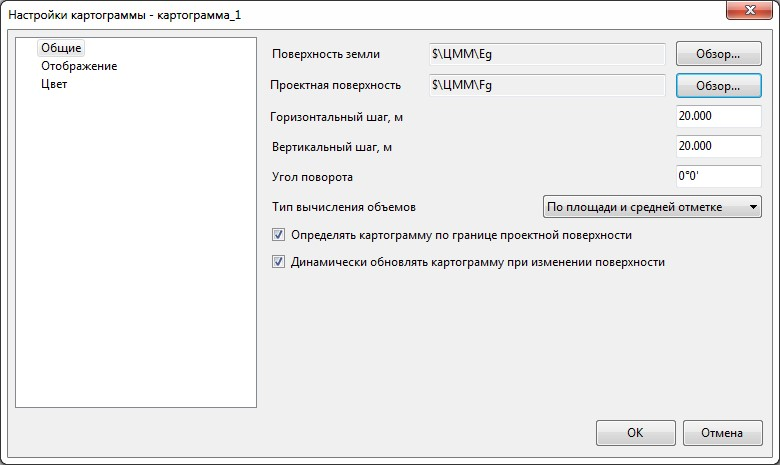
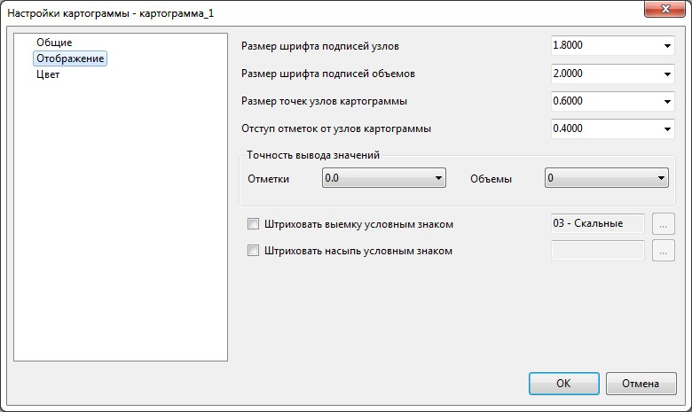
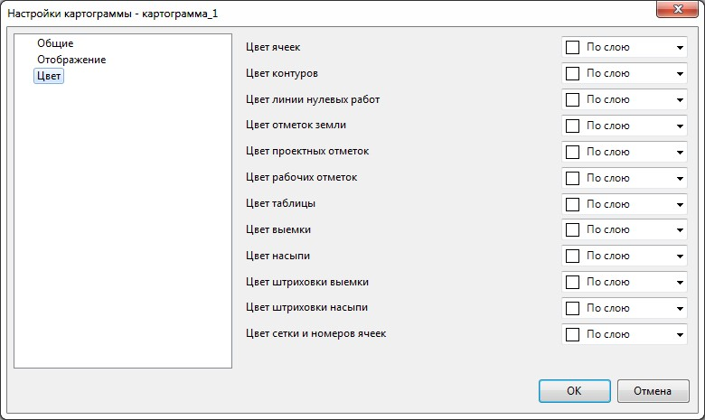

# Настройка отображения картограммы

Имеется возможность настроить точность вывода значений объемов и отметок, а также задать цвет для всех элементов картограммы.

Для этого:
1. В **Структуре проекта** нажмите правой кнопкой мыши на текущей модели **Картограммы**, выберите пункт **Настройки**, в открывшемся окне выделите соответствующую модель картограммы, раскрыв дерево объектов **Модели – Картограммы**:

   

   

   В данном окне задаются настройки текущей картограммы. Для задания настроек по умолчанию для вновь создаваемых картограмм, а также общих настроек проекта, воспользуйтесь элементом меню **Сервис - Настройки**.

   

   На вкладке **Общие** имеется возможность изменить те параметры с которыми изначально создавалась картограмма.

   

   Подробно данные параметры были описаны выше в разделе [Создание площадных картограмм](create_cartogram.md).

   

   Вкладка **Отображение** 

   

   На данной вкладке в соответствующих полях ввода и выпадающих списках настраиваются размеры шрифтов элементов картограммы и параметры точности выводимых значений, а также имеется возможность выбрать штриховку для контуров насыпи и выемки.

   Вкладка **Цвета**

   

   На вкладке **Цвета** имеется возможность задать необходимый цвет по умолчанию каждому элементу картограммы.

2. Задайте необходимые настройки и нажмите **ОК**.