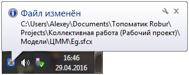

# Основные принципы коллективной работы

При коллективной работе над проектом каждый участник может редактировать те модели, которые небыли ранее забраны на редактирование другими пользователями. Для этого необходимо сделать соответствующую модель активной.



 Принципы создания и настройки новых моделей (ЦММ, Автомобильные дороги, Картограммы и т.п.) были описаны ранее в соответствующих разделах.



Отличительной особенностью при работе с элементами проекта в режиме коллективной работы является то, что при смене активной модели, автоматически происходит сохранение предыдущей модели, которая редактировалась ранее. Если же над проектом не выполняет одновременно работу группа специалистов, то опцию Разрешить коллективную работу рекомендуется отключить.

Как уже было сказано ранее, если какая либо модель редактируется пользователем, то остальным участникам проекта она доступна только для просмотра, причем они видят ее состояние на момент последнего сохранения.



 Изменения сделанные пользователем в окне **Структура проекта**, к примеру создание новой модели или переименование текущей, отражается у других участников сразу же.



Когда какой-либо участник проекта выполняет сохранение проекта, сохраняются изменения которые он выполнил в текущей модели. При этом остальные пользователи автоматически получают уведомление, что соответствующий пользователь внес изменения в данный элемент проекта:



 При сохранении данных проекта, обновление на всех компьютерах происходит одновременно и скорость сети делится на количество потоков. При большом количестве участников проекта рекомендуется использовать быстродействующие сети (со скоростью не менее 1Гбит/сек).

