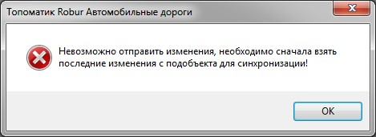
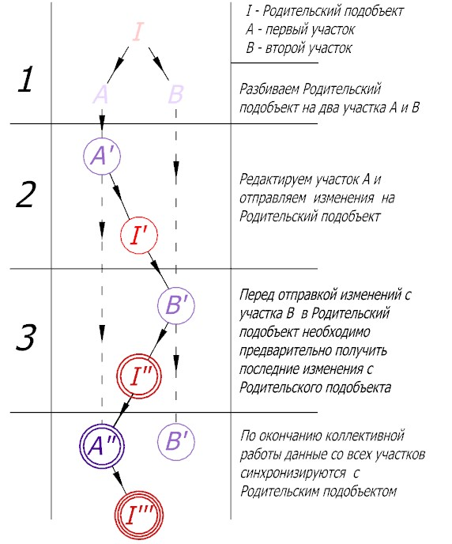
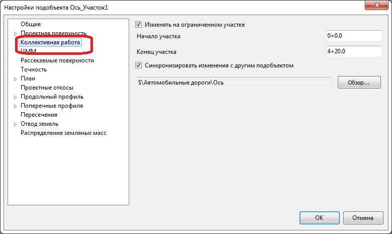

# Коллективная работа с подобъектом. Общие сведения

Коллективная работа над одним подобъектом подразумевает возможность единовременно несколькими исполнителями (каждый на своем участке подобъекта) проектировать продольный и поперечные профили, наносить геологические разрезы и т.п..



 На данный момент возможность одновременного редактирования плановой части подобъекта, в рамках коллективной работы, не предусмотрена.



Для этого, подобъект делится на участки. Каждый участок представляет собой отдельный подобъект, все изменения с которого синхронизируются с исходным (родительским) подобъектом. Имеется специализированный функционал, который позволяет получать и отправлять изменения в Родительский подобъект.



 В случае если при отправке изменений в **Родительский подобъект** появляется сообщение данного вида:

 

 Это означает, что **Родительский подобъект** был изменен (путем отправки изменений с другого участка) в результате чего сначала необходимо получить последние эти изменения, а затем отправить изменения с участка.



Ниже условно представлена схема коллективной работы двумя исполнителями над одним подобъектом:

При необходимости в **Настройках** текущего подобъекта в разделе **Коллективная работа** можно поменять границы редактирования участка, а также **Родительский подобъект**, с которым производится синхронизация:

