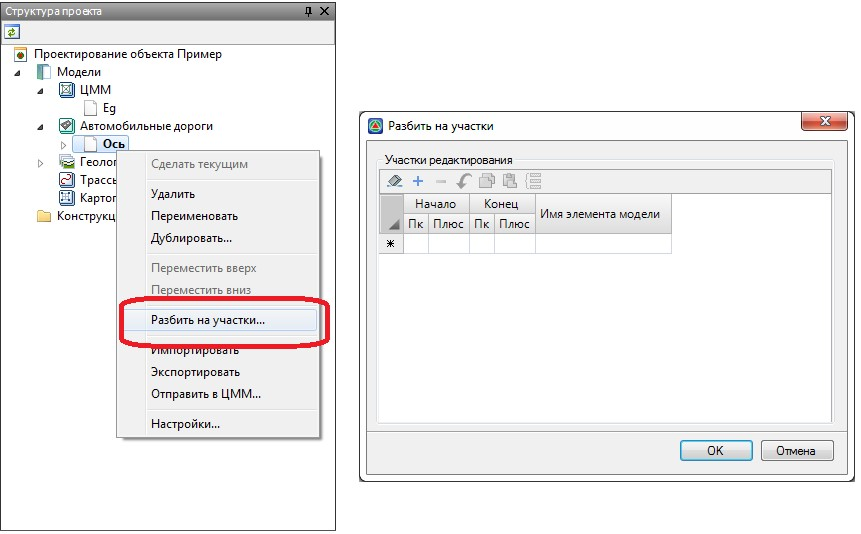
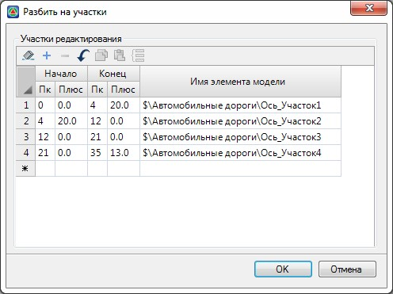
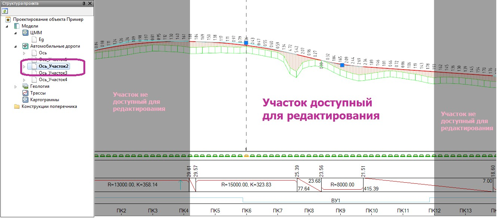
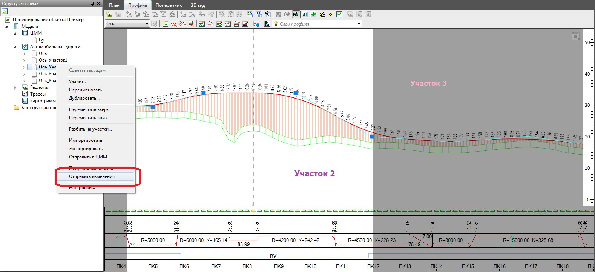
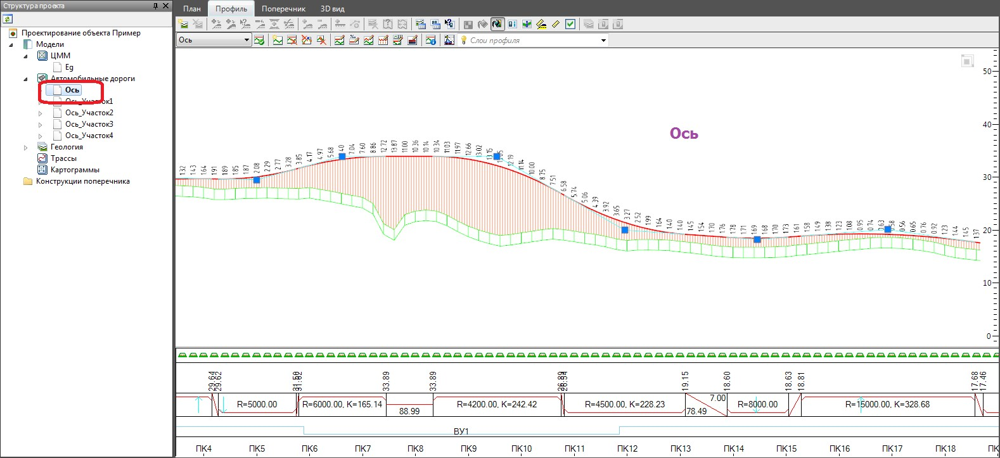
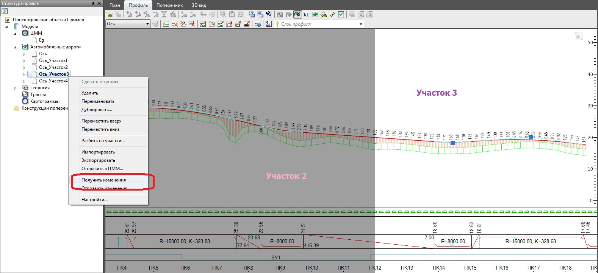
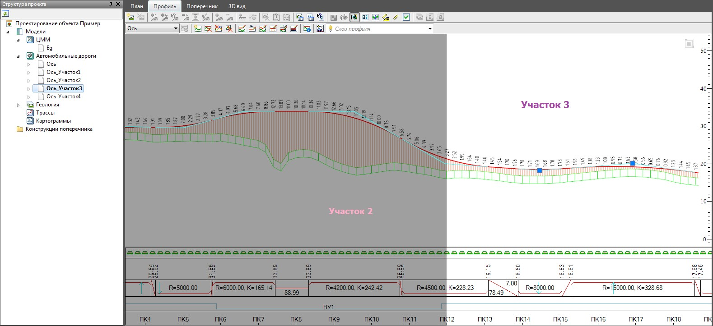

# Последовательность работы

Для коллективной работы с одним подобъектом:

1. В окне **Структура проекта** щелкните правой кнопкой мыши на наименовании исходного подобъекта, который необходимо отредактировать нескольким пользователям одновременно. В контекстном меню выберите функцию **Разбить на участки**, откроется диалоговое окно:

   

   Каждая строка таблицы определяет границы участка редактирования подобъекта.

2. Заполните таблицу, указав пикетажные значения начала и конца каждого участка:

   

   

   При коллективной работе над проектным профилем границы смежных участков рекомендуется выбирать преимущественно на прямолинейных участках продольного профиля, а также предварительно согласовать их с другими исполнителями смежных участков.

   

3. Нажмите **Ок**.

   В результате в **Структуре проекта** будут созданы дополнительные подобъекты (например Ось\_Участок1, Ось\_Участок2 и т.д.), каждый из которых определяет один участок трассы, на котором исполнитель может выполнять редактирование продольных и поперечных профилей:

   

   На рисунке выше участок подобъекта доступный для редактирования отображается на светлом фоне, смежные участки не доступные для редактирования отображаются на более темном фоне.

4. После того как на каком - либо участке были выполнены необходимые корректировки, их нужно синхронизировать с **Родительским подобъектом**. Это необходимо сделать для того чтобы, во-первых, все выполненные корректировки отобразились на **Родительском подобъекте**, а вовторых, чтобы другие исполнители на своих участках смогли увидеть сделанные изменения.

   Для этого:

   * В **Структуре проекта** нажмите правой кнопкой мыши на текущем подобъекте участка, выберите функцию **Отправить изменения**:

     

   * В результате все изменения, выполненные на текущем участке (например Ось\_Участок2), будут отправлены на **Родительский подобъект** (например Ось):

     

   * Для того чтобы другому исполнителю на своем участке (например Ось\_Участок3) увидеть какие были выполнены изменения на смежном участке (например Ось\_Участок2) необходимо выбрать функцию **Получить изменения**:

     

   * В результате на смежном участке отобразятся все выполненные изменения:

     

   * После синхронизации данных на текущем участке, далее можно отправлять изменения с этого участка в **Родительский подобъект**.

5. После того как коллективная работа над подобъектом завершена, и все данные участков были синхронизированы с **Родительским подобъектом**, они могут быть удалены из проекта.