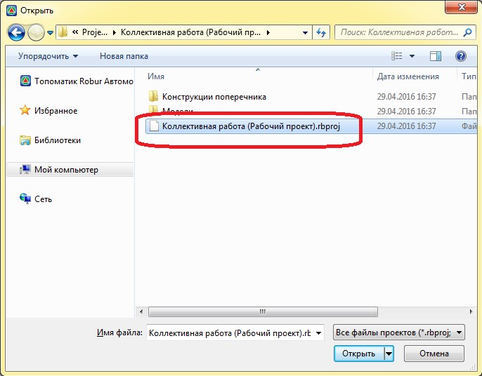
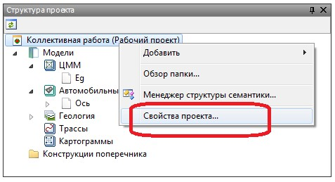
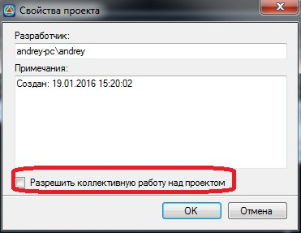
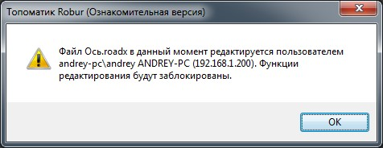
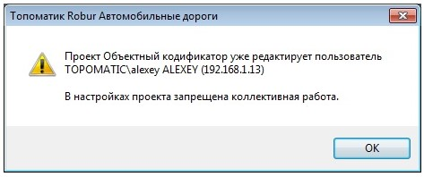

# Настройка папки проекта для коллективной работы

Папку с проектом рекомендуется сразу выложить в общедоступное для других пользователей место. К примеру, на сетевой диск.

Для первичного открытия проекта из общей папки:

1. Выберите меню **Проект - Открыть файл**;
2. Откроете в проводнике **Windows** папку с проектом и щелкните дважды левой кнопкой мыши по файлу с расширением **\*.rbproj**

   

Изначально проект доступен для редактирования только первому пользователю открывшему проект. Для того чтобы сделать его доступным остальным участникам:

1. В окне **Структура проекта** щелкните правой кнопкой мыши по наименованию проекта и выберите из появившегося контекстного меню пункт **Свойства проекта**:

   

2. В открывшемся окне установите опцию **Разрешить коллективную работу** и нажмите **ОК**.

   

Теперь проект будет доступен остальным участникам. Для подключения к коллективной работе остальным участникам проекта также необходимо открыть его из общедоступной папки. Данная последовательность действий была описана выше.



1. При дальнейших открытиях проекта остальным пользователям может выдаваться сообщение, что на текущий момент времени его определенные элементы редактируются другими участниками и доступны только для просмотра:

   

2. Если в настройках проекта не была установлена опция **Разрешить коллективную работу над проектом**, то подключение к нему остальных участников будет невозможно. В данном случае при открытии проекта будет выдаваться следующие сообщение:

   

