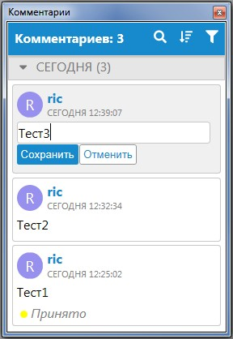
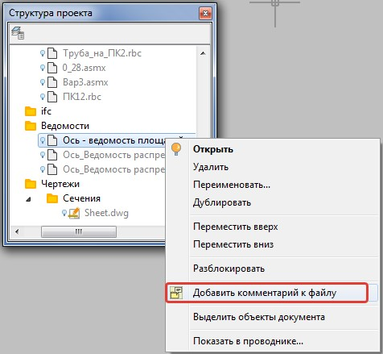

# Добавление комментария к файлу или проекту

Чтобы добавить к проекту общий комментарий, не привязанный к определенному файлу (чертежу, модели и т.п.):

1. Воспользуйтесь функцией Меню **Задачи-Комментарии-Добавить-Комментарий**.
2. В окне **Комментарии** введите текст комментария и нажмите **Сохранить**. Созданный комментарий отобразится в списке окна **Комментарии**:

   

При необходимости комментарий можно добавить к дополнительному файлу, находящемуся в окне **Структура проекта**. Для этого:

1. В окне **Структура проекта** нажмите правой кнопкой мыши по соответствующему файлу и выберите из появившегося контекстного меню пункт **Добавить комментарий**.

   

2. В окне **Комментарии** введите требуемый текст и нажмите **Сохранить**.

В результате созданный комментарий отобразится в списке окна **Комментарии**. После этого также появится возможность открывать дополнительные файлы непосредственно из окна **Комментариев**. Данный механизм будет более подробно описан далее, в соответствующем разделе.