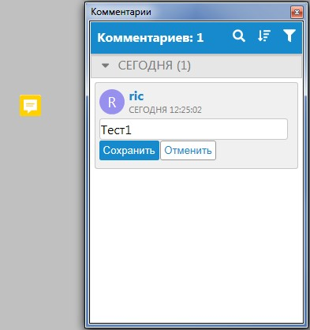
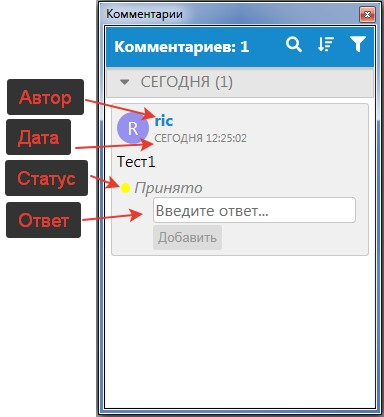

# Добавление точечного комментария

Комментарии данного типа отображаются во всех рабочих окнах в виде точечных условных знаков, привязанных к соответствующим точкам вставки.

Для того чтобы добавить точечный комментарий:

1. Воспользуйтесь элементом меню **Задачи-Комментарии-Добавить-Точечный комментарий**.
2. При помощи левой кнопки мыши укажите точку вставки в соответствующем окне программы.
3. В открывшемся окне **Комментарии** введите соответствующий текст и нажмите **Сохранить**.

В результате созданный комментарий отобразится в списке окна **Комментарии**, а также в указанной области рабочего окна:

Комментарий содержит ряд свойств, отображаемых в виде дополнительной информации:

**Автор** – имя учетной записи пользователя, который оставил комментарий.

**Дата** – дата и время создания комментария.



Если работа над проектом ведется из разных регионов с разными часовыми поясами, то программа будет показывать время добавления комментария, пересчитанное на местное время.



**Ответы** – дополнительные комментарии, добавленные к основному. Чтобы добавить ответ к комментарию, выделите соответствующий комментарий в рабочем окне программы либо в списке **Комментариев**, далее введите дополнительный комментарий в пустую строку и нажмите **Добавить**.

**Статус** – устанавливаемое пользователем состояние комментария. Назначение статуса описано далее, в разделе [Редактирование комментариев](editing_comments.md).



1. Добавленные комментарии в любой момент можно скрыть при помощи элемента меню **Задачи-Комментарии-Показать/скрыть**.
2. Т**очечный комментарий**, как и **Область комментария**, добавляется непосредственно к активной модели проекта, поэтому при смене активной модели он погаснет в рабочем окне программы, но будет по-прежнему отображаться в общем списке окна **Комментарии**.

