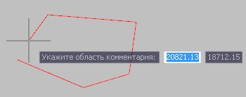
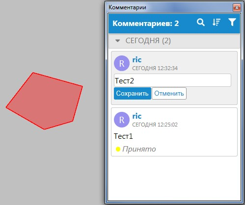

# Добавление области комментария

Данный тип комментария используется для акцентирования внимания на определенной площади участка проекта.

Для создания области комментария:

1. Воспользуйтесь элементом меню **Задачи-Комментарии-Добавить-Область комментария**.
2. Левой кнопкой мыши укажите контур области комментария, для завершения ввода области щелкните правой кнопкой мыши или нажмите клавишу **Enter**:

   

3. На панели **Комментарии** для вновь добавленного комментария введите текст и нажмите **Сохранить**.

В результате созданный комментарий отобразится в списке окна **Комментарии**, а также в указанной области рабочего окна:



Основные информационные характеристики комментария были описаны ранее в разделе [Добавление точечного комментария](adding_point_comment.md).


