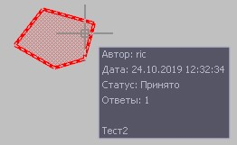
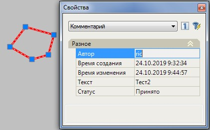
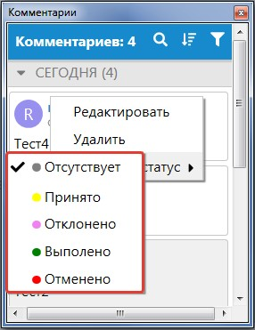
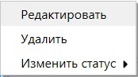
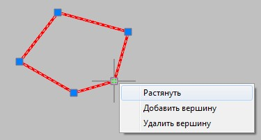

# Редактирование комментариев

При наведении в рабочем окне курсора на комментарий, во всплывающем информационном окне отобразится его текст и основные свойства:



При выборе комментария в рабочих окнах программы его текстовые характеристики также отобразятся и в стандартном окне **Свойства**. Пользователь может воспользоваться функцией быстрого выбора для поиска нужного комментария, например, **По времени создания**:

 



Чтобы задать или изменить статус для комментария:

1. Откройте окно **Комментарии** (если оно не было открыто ранее) при помощи элемента меню **Задачи-Комментарии-Комментарии**.
2. Далее наведите курсор на требуемый комментарий и нажмите на кнопку  .
3. Выберите из контекстного меню пункт **Изменить статус**, а затем назначьте требуемый:

   

Содержимое комментария, а также ответы к нему можно отредактировать либо удалить. Для этого:
1. В окне **Комментарии** наведите курсор мыши на комментарий и нажмите на кнопку  .
2. Выберите из появившегося контекстного меню необходимое действие:

   

При необходимости положение **Точечного комментария**, а также границы **Области комментария** можно легко отредактировать. Точку вставки или вершину **Области комментария** можно переместить при помощи левой кнопки мыши.

Чтобы удалить либо добавить вершину для **Области комментария**, щелкните по ней правой кнопкой мыши и выберите из появившегося контекстного меню необходимую функцию:

