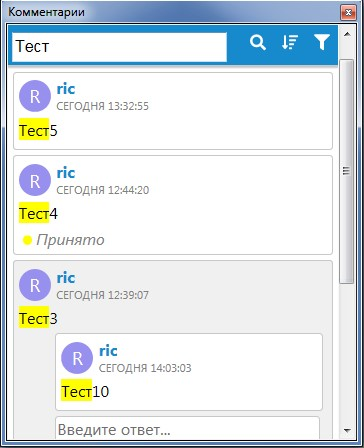
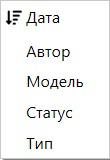
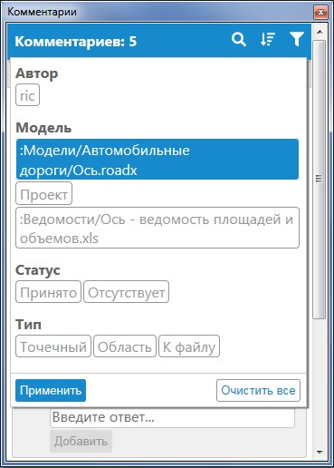

# Работа с окном Комментарии

Имеется возможность выполнять сортировку, фильтрацию, а также поиск комментария в проекте. Чтобы открыть окно **Комментарии** (если оно не было открыто ранее), воспользуйтесь элементом меню **Задачи-Комментарии-Комментарии**.

Чтобы быстро найти в проекте область, на которой расположен комментарий, наведите на него курсором мыши в списке **Комментариев** и нажмите на данную кнопку  . Программа может при необходимости переключиться на другое рабочее окно, автоматически сфокусироваться на точке вставки комментария и сделать модель, для которой он был добавлен, активной. Если данный комментарий прикреплен к файлу стороннего формата, то он будет открыт в стороннем ПО (например, ведомость, созданная в формате **.xls**, будет открыта при помощи Microsoft Excel).

Комментарий из списка можно быстро найти при помощи поисковой строки. Для этого нажмите на кнопку  и в строке напишите ключевое слово. Данный поиск ссылается не только на название самого комментария, но и на содержимое его ответов:

Список комментариев можно сортировать. Для этого нажмите на кнопку  и выберите параметр, по которому будет отсортирован список:

Помимо этого, список комментариев можно отфильтровать по определенным параметрам. Для этого нажмите на кнопку **Фильтр** , задайте необходимые настройки и выберите **Применить**:

Чтобы сбросить фильтр, откройте снова окно его настроек и нажмите кнопку **Очистить все**.