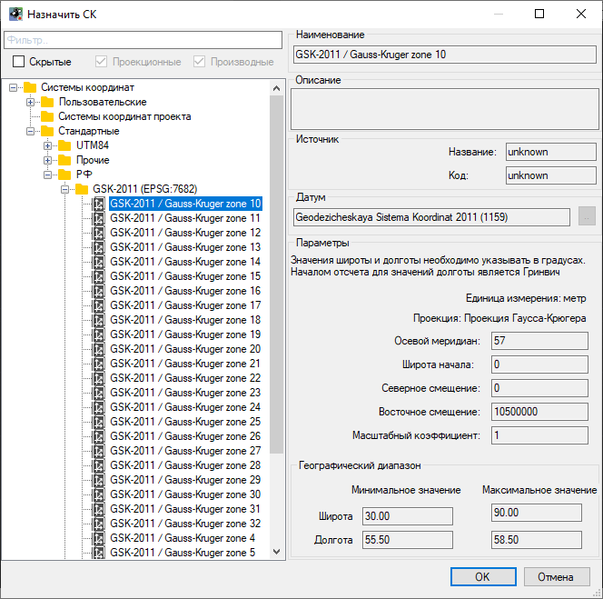
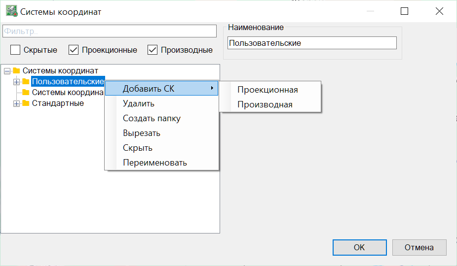

# Работа с системами координат

Основой для геодезических и картографических работ являются государственные, местные, локальные и международные системы координат.

## Назначение Системы координат проекта

Для задания проекту Системы координат выполните следующую последовательность действий:

1. Выберите меню **Задачи - Координаты – Назначить СК**.

2. В открывшемся окне выберите из списка необходимую СК: 

3. Нажмите кнопку **ОК**.

## Библиотеки данных

В программе имеются Библиотеки **Систем координат**, **Датумов** и **Эллипсоидов**, где по умолчанию добавлен стандартный набор элементов и их параметров.

Предусмотрена возможность пополнять библиотеки, создавая элементы со своими параметрами, для этого:

1. Выберите меню **Задачи - Координаты - Библиотека СК\Датумы\Эллипсоиды**, откроется окно Библиотеки.

2. В окне **Библиотеки** в левой части нажмите **ПКМ** на нужном разделе и выберите соответствующий пункт меню:

3. Созданному элементу задайте соответствующие параметры и нажмите ОК.



Все добавляемые пользователем элементы сохраняются в файл Proj.db, который расположен по умолчанию по следующему пути C:\Users\ *Папка пользователя* \Documents\Топоматик Robur\Settings. При необходимости расположение файла Proj.db и путь к нему можно изменить, перейдя в **Настройки** (меню **Сервис**) в раздел **Система координат** - **Пользовательская БД**.


