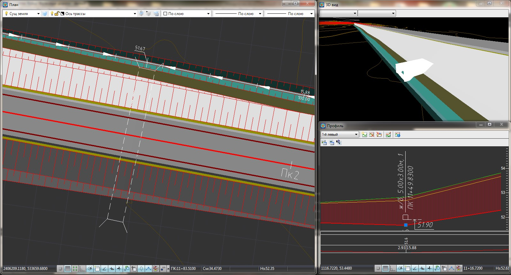

# Ввод водопропускных труб

Данный блок функций позволяет назначать местоположения малых водопропускных сооружений (трубы), пересекающих трассу. Укладку трубы можно контролировать в окнах плана, профиля, а также окна 3D-вида.

Способ ввода трубы зависит от текущего рабочего окна программы (**План** или **Профиль**) и может отличаться. Для создания водопропускной трубы:

1. Выберите элемент меню **Задачи – Искусственные сооружения – Ввести трубу**, курсор примет форму прицела, укажите начало и конец трубы (в случае если текущее рабочее окно программы **План**) или укажите точку вставки трубы (если текущее рабочее окно программы **Профиль**).

   

   Отметки начала и конца трубы принимаются по умолчанию равными отметкам поверхности черной земли. Отметка положения трубы на профиле определяется интерполяцией между отметками начала и конца трубы, указанных на плане.

   

2. В результате программа отрисует трубу в окне **План**, **Профиль** и отобразит в окне **3D вида**:

   
