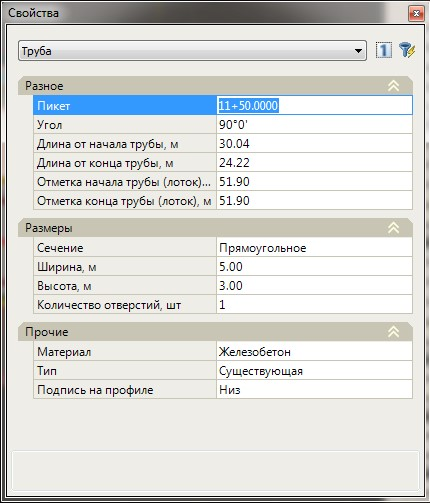

# Редактирование водопропускной трубы

Функционал по редактированию добавленной водопропускной трубы включает в себя возможность визуального перемещения трубы и изменение основных параметров водопропускного сооружения с помощью окна **Свойства**.

Для этого:

1. В окне **План** выделите трубу левой кнопкой мыши, на начале и конце трубы появятся ручки (грипы), за которые можно произвести перемещение водопропускного сооружения.
2. Выделив трубу, в окне **Свойства** отобразятся ее параметры:

   

   В поле **Разное** задается положение трубы на трассе:

   * **Пикет** – для изменения пикетажного положения трубы.
   * **Угол** – угол поворота трубы, задается относительно направления пикетажа трассы.
   * **Длина от начала трубы** – расстояние от первой\начальной точки указанной при вставке трубы до оси трассы.
   * **Длина от конца трубы** – расстояние от второй\конечной точки указанной при вставке трубы до оси трассы.
   * **Отметка начала\конца трубы (лоток)** – задаются отметки начала и конца трубы по низу лотка.
   
   В поле **Размеры** задаются параметры отрисовки трубы и отображения условного знака в окне **Профиль**:

   * **Сечение** – селектор выбора сечения трубы, может быть: Круглое и Прямоугольное. В зависимости от выбранного сечения водопропускное сооружение отображается соответствующим условным знаком.
   * **Ширина\Высота или Диаметр** – при выбранном сечении **Прямоугольное** или **Круглое задаются** соответствующие значения размеров трубы.
   * **Количество отверстий** – задается количество отверстий водопропускного сооружения.
   
   В поле **Прочее** задается дополнительные параметры трубы:

   * **Материал** – имеется возможность выбрать материал изготовления водопропускного сооружения. Выбранный параметр влияет на подпись условного знака трубы в окне **Профиль** и на выходные данные.
   * **Тип** – в данном выпадающем списке выберите тип трубы, данный параметр учитывается при формировании выходных ведомостей.
   * **Подпись на профиле** – в зависимости от выбранного параметра (Низ или Верх) определяется по какой части лотка (верхней или нижней) должна быть подписана отметка трубы.
