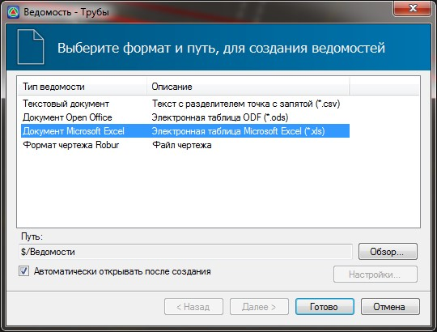

# Ведомость искусственных сооружений

Для того, чтобы создать ведомость искусственных сооружений (труб) воспользуйтесь элементом меню **Проект – Создать ведомость – Трубы**, откроется окно выбора формата формируемой ведомости и пути ее сохранения:

Нажмите **Готово**, программа сформирует ведомость.
