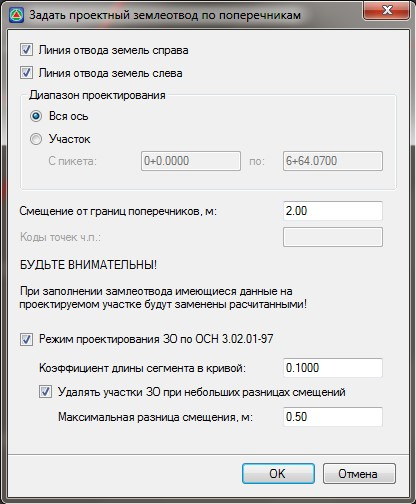

# Задание границ проектного землеотвода по поперечникам

Линия проектного землеотвода может быть автоматически создана от границ проектных поперечных профилей. Для этого:

1. Выберите элемент меню **Задачи - Отвод земель - Задать проектный землеотвод по поперечникам**. Появится диалоговое окно:

   

2. Задайте основные параметры формирования линии проектного отвода:

   **Линия отвода земель справа/слева** - по умолчанию формируются линии с обеих сторон трассы. Снимите соответствующую опцию, если необходимо сформировать границу с одной стороны.

   **Диапазон проектирования** - по умолчанию границы проектного отвода формируются по поперечникам на всем протяжении трассы. Если, например, необходимо создать или обновить границы отвода на определенном участке трассы, установите опцию Участок и задайте в соответствующих полях его пикетажные значения.

   **Смещение от границ поперечников, м** - в данном поле задается расстояние от границ проектного отвода до границ проектных поперечников.

   **Режим проектирования по ОСН 3.02.01-97** - включение режима проектирования линий отвода земель с учетом данного нормативного документа.

   

   Функция **Режим проектирования по ОСН 3.02.01-97** доступна при создании отвода земель у подобъекта типа **Железная дорога**. У подобъектов типа **Автомобильная дорога** данный режим проектирования не используется.

   

   Настройки проектирования отвода земель по ОСН 3.02.01 – 97 задают параметры создания ступеней (сегментов проектного землеотвода) при проектировании. **Коэффициент длины сегмента в кривой** определяет максимальную длину сегмента линии землеотвода, для кривых участков, в зависимости от радиуса (по умолчанию 0.1 / R – нормативное значение).

   При проектировании отвода земель часто границы соседних поперечников (их смещения от оси трассы) меняются не очень сильно. Поэтому, невыгодно создавать лишние ступени землеотвода, отличающиеся по смещению менее, чем на 0.5 метра. Для этого предусмотрена настройка **Удалять участки проектного ЗО при небольших разницах смещений**, а также минимальная разница, при которой ступень все-таки создается (**Максимальная разница смещения, м**).

3. Нажмите **ОК**.

В результате программа по данным поперечных профилей сформирует линии проектного отвода и отобразит их в окне **План** и **Поперечник**.

Т.к. линии отвода формировались по поперечникам, то их вершины (точки перелома) будут расположены на тех пикетах, на которых расположены проектные поперечные профили.

На криволинейных участках трассы, будут добавлены также дополнительные вершины, так как проектирование отвода земель по “**ОСН 3.02.01 - 97**” требует добавления дополнительных вершин на кривых в зависимости от их радиуса.

При необходимости положение созданной границы отвода может быть отредактировано табличным или графическим способом. Функционал графического редактирования данных линий будет рассматриваться [ниже](visual_editing_borders.md), в соответствующем разделе.
