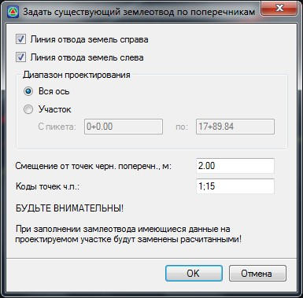

# Задание границ существующего землеотвода по поперечникам

Линия существующего землеотвода может быть автоматически создана от точек черного поперечника с заданными кодами. Для этого:

1. Выберите элемент меню **Задачи - Отвод земель - Задать существующий землеотвод по поперечникам**. Появится диалоговое окно:

   

   В поле **Коды точек** ч.п. задаются коды точек черного поперечника, к примеру - подошвы насыпи, относительно которых необходимо строить границу существующего отвода.

   **Смещение от точек черного поперечника, м**. - в данном поле задается расстояние на которое должны быть смещены границы существующего отвода, относительно этих характерных точек черного поперечника .

   Остальные настройки данного окна аналогичны описанным выше.

2. Задайте необходимые настройки формирования линии существующего отвода относительно проектного и нажмите **ОК**.

В результате программа по данным черных поперечников сформирует линии существующего отвода и отобразит их в окне **План** и **Поперечник**.

Т.к. линии отвода формировались по поперечникам, то их вершины (точки перелома) будут расположены на тех пикетах, на которых расположены черные поперечные профили. При необходимости положение созданной границы отвода может быть отредактировано табличным или графическим способом. Функционал графического редактирования данных линий будет рассматриваться [ниже](visual_editing_borders.md), в соответствующем разделе.
