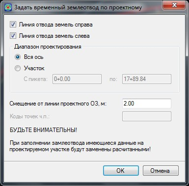

# Задание границ временного землеотвода по границам проектного

Линия временного землеотвода может быть автоматически создана от границы проектного землеотвода. Для этого:

1. Выберите элемент меню **Задачи - Отвод земель - Задать временный землеотвод по проектному**. Появится диалоговое окно:

   

   В поле **Смещение от линии проектного ЗО, м** - задается расстояние, на которое должны быть смещены вершины границ временного землеотвода относительно вершин границ проектного отвода земель. Остальные настройки данного окна аналогичны описанным выше.

2. Задайте необходимые настройки формирования линии временного отвода относительно проектного и нажмите **ОК**.

В результате программа по данным границ проектного отвода сформирует линии временного отвода и отобразит их в окне **План** и **Поперечник**.

При необходимости положение созданной границы отвода может быть отредактировано табличным или графическим способом. Функционал графического редактирования данных линий будет рассматриваться [ниже](visual_editing_borders.md), в соответствующем разделе.
