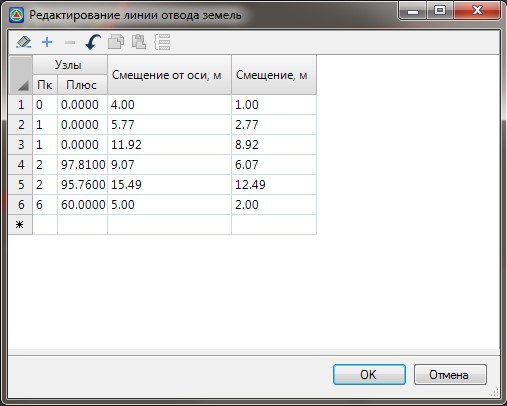

# Задание землеотвода табличным способом

Расстояния от границ отвода земель до оси трассы или границ земляного полотна задаются в соответствующих таблицах структуры проекта.

Для задания проектного землеотвода табличным способом:

1. Раскройте в окне **Структура проекта** дерево таблиц текущего подобъекта. Откройте одну из таблиц группы **Отвод земель**, например: **Отвод земель - Проектный - Правый**.

2. В открывшейся таблице задайте пикеты характерных точек границы линии отвода и их расстояния относительно оси:

   

   Значения расстояний относительно оси задаются в поле **Смещения от оси**. В поле **Смещение** задаются расстояния от границ линий отвода до крайних точек проектного поперечного профиля.

   Данные столбцы являются взаимозависимыми, т.е. изменение данных в одном столбце приводит к автоматическому пересчету значений расстояний в другом. Если на соответствующем пикете отсутствует поперечный профиль, то значения расстояний в обоих столбцах будет одинаковым.

3. Для выхода из данной таблицы нажмите **ОК**.

В результате, программа отрисует линии проектного землеотвода на плане и поперечниках:

Задание временного и существующего землеотвода табличным способом осуществляется аналогично заданию границ проектного землеотвода. В графе «Смещение» для временного землеотвода задается не расстояние от крайних точек поперечных профилей, а смещение от линии проектного отвода земель.

Механизм задания границ землеотвода табличным способом является наиболее универсальным. Однако имеются различные способы автоматического заполнения данной таблицы. Они рассматриваются ниже.
