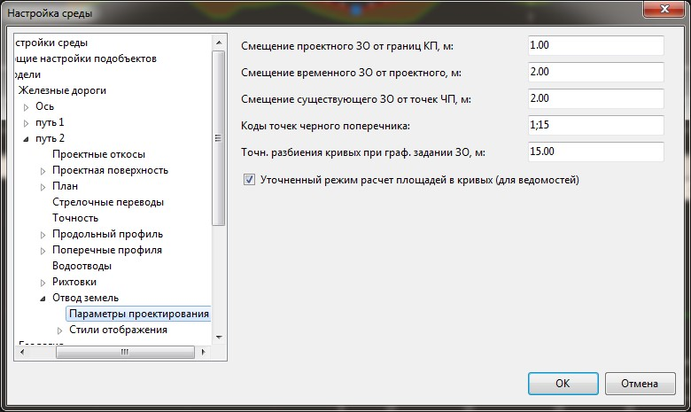

# Настройка основных параметров расчета

Для задания основных настроек расчета используемых для текущего подобъекта:

1. В **Структуре проекта** нажмите правой кнопкой мыши на текущей модели **Железная дорога**, выберите пункт **Настройки**.
2. Раскройте дерево настроек текущего подобъекта. В группе настроек **Отвод земель** откройте вкладку **Параметры проектирования**:

   

   

   В данном окне задаются настройки текущей модели подобъекта Железные или Автомобильные дороги. Для задания настроек по умолчанию для вновь создаваемых моделей, а также общих настроек проекта, воспользуйтесь элементом меню **Сервис - Настройки.**

   

   **Смещение проектного, временного и существующего землеотвода** - в данных полях задается значение, предлагаемое по умолчанию при создании проектного и существующего землеотвода по поперечникам, а также временного землеотвода относительно проектного.

   **Коды точек черного поперечника** - номера кодов предлагаемые по умолчанию, для построения границ существующего землеотвода по поперечникам.

   **Точность разбиения кривых при графическом задании ЗО** – настройка, определяющая на сегменты какой длины, будут разбиваться криволинейные участки примитивов, при формировании существующего или временного землеотвода по примитивам.

   **Уточненный режим расчета площадей в кривых для ведомостей** производит наиболее точное разбиение кривых участков (на участки по 0.1 м), чтобы достичь более точного расчета площадей занимаемых земель. Данная настройка участвует только в формировании ведомостей.
