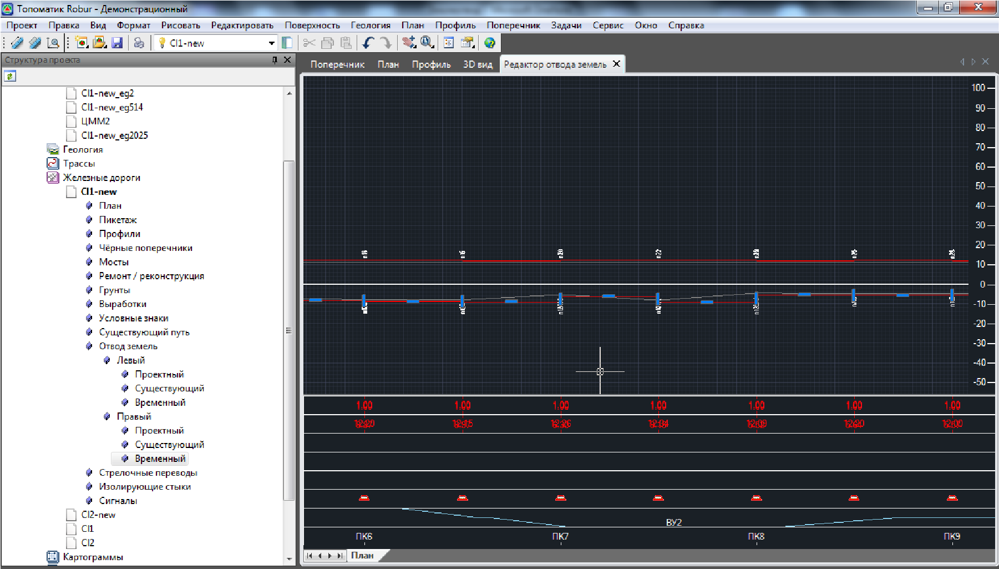
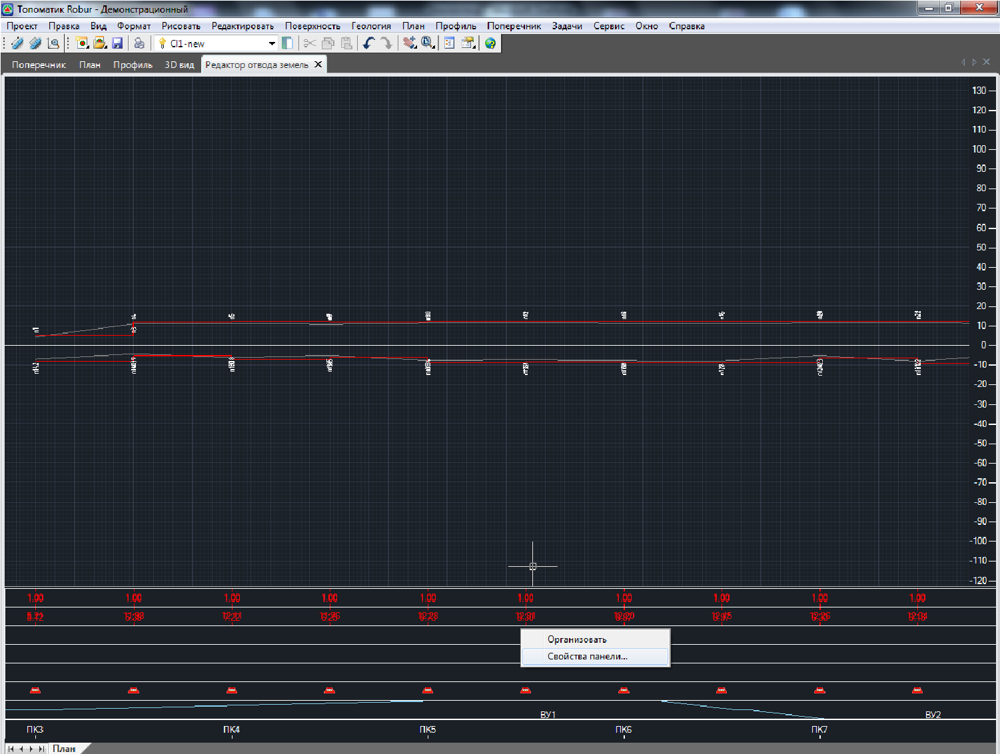
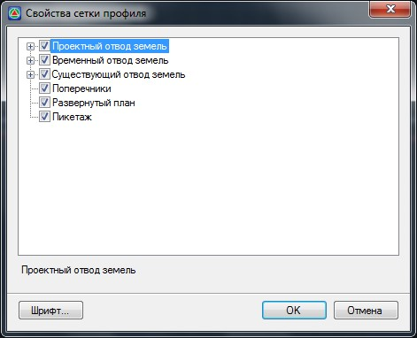
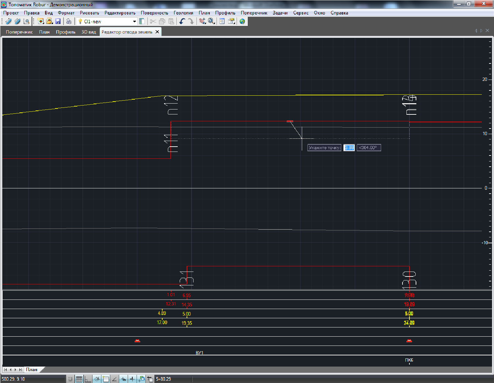
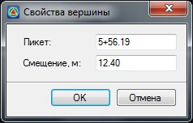
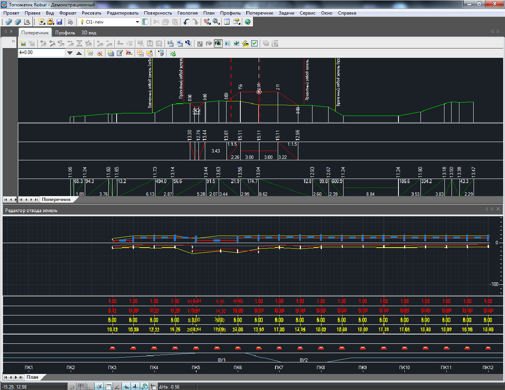

# Редактирование границ отвода в окне развернутого плана

Окно **Развернутый план** может быть использовано как для анализа положения линий отвода относительно оси трассы, которая представлена в спрямленном виде, так и для их визуального редактирования.

Для открытия данного окна выберите элемент меню **Задачи - Отвод земель - Показать окно**:

В графическом поле данного окна отображается развернутая ось трассы, линии границ проектных поперечников, а также линии границ отвода.

Видимость данных отображаемых в нижней части окна **Развернутый план** настраивается аналогично данным отображаемым в шапке окна **Профиль** и **Поперечник**. Для отключения/ включения видимости каких либо строк шапки:

1. Щелкните по строкам с данными отображаемыми в нижней части окна правой кнопкой мыши и выберите из появившегося контекстного меню пункт **Свойства панели**:

   

2. Установите опции напротив соответствующих данных, которые необходимо отображать в нижней части окна и нажмите **ОК**.

   

Для визуального редактирования линии землеотвода:

1. Выделите ее левой кнопкой мыши в графическом поле окна **Развернутый план**.
2. Вершины линии будут подсвечены синими значками.

   -Удерживая соответствующую вершину левой кнопкой мыши, перемещайте ее в требуемое место графического поля :

   

   Вершины линии временного и существующего землеотвода могут перемещаться произвольным образом.

   

   В случае создания проектного отвода земель, не используя режим проектирования ЗО по ОСН 3.02.01 - 97 (см. п. [Задание границ проектного землеотвода по поперечникам](assignment_borders_at_cross_profiles.md)), перемещение вершин может также осуществляться произвольным образом.

   

   Однако, если линия проектного отвода отрисовывана ступенчатым способом, то ее вершины можно перемещать только ортогонально. Горизонтальные значки можно перемещать по перпендикуляру относительно оси трассы, меняя этим величину смещения границы отвода (ширину ступени). Вертикальные значки можно перемещать вдоль оси трассы, меняя этим длину участка с заданным смещением (длину ступени).
    
   * Для задания точного пикетажного положения или смещения вершины линии отвода:
    
     1. Щелкните по соответствующей вершине правой кнопкой мыши и выберите из появившегося контекстного меню пункт **Свойства вершины**. Появится диалоговое окно:

        

     2. Задайте в соответствующих полях пикет и смещение вершины и нажмите **ОК**.
     
   * Для удаления какой-либо вершины линии отвода, щелкните по ней правой кнопкой мыши и выберите из появившегося контекстного меню пункт **Удалить**.
  
   * Для добавления дополнительной вершины линии отвода, щелкните дважды по линии левой кнопкой мыши. В результате появится новая вершина. При необходимости переместите ее в требуемое место с помощью функционала, который был описан выше.
     
   Редактирование границ отвода на развернутом плане приводит к автоматическому их обновлению в окнах **План** и **Поперечник**.

   
