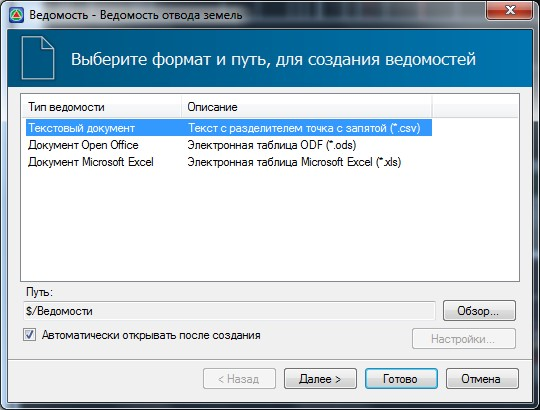

# Формирование выходных ведомостей

Предусмотрено формирование следующих документов:

* Ведомость координат пунктов землеотвода.
* Ведомость площадей проектного, временного, существующего землеотвода, а также дополнительно занимаемых земель.

Для формирования соответствующей ведомости:

1. Выберите элемент меню **Проект - Создать ведомость - Отвод земель….**.
2. В открывшемся мастере формирования ведомостей выберите формат формируемой ведомости:

   

3. Нажмите **Готово**.

В результате программа сформирует ведомость и откроет ее в соответствующем редакторе.
