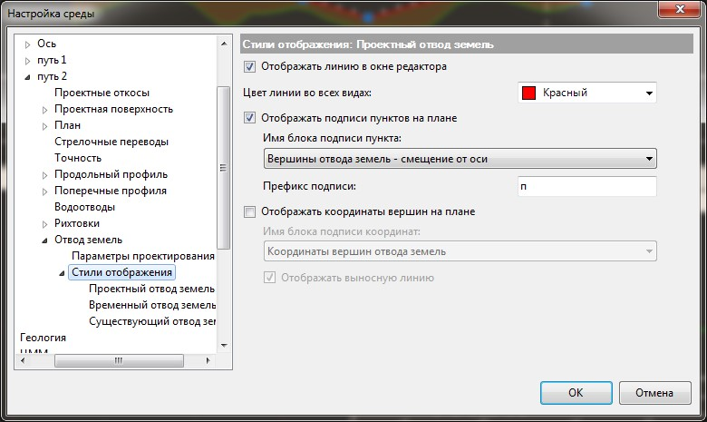

# Настройка отображения линий отвода земель

Для задания основных параметров отображения и настройки подписей вершин линий отвода земель:

1. В **Структуре проекта** нажмите правой кнопкой мыши на текущей модели **Железная дорога**, выберите пункт Настройки.
2. Раскройте дерево настроек текущего подобъекта. В группе настроек **Отвод земель** откройте вкладку **Стили отображения**:

   

   

   1. В данном окне задаются настройки текущей модели подобъекта Железные и Автомобильные дороги. Для задания настроек по умолчанию для вновь создаваемых моделей, а также общих настроек проекта, воспользуйтесь элементом меню **Сервис - Настройки**.
   2. Настройки отображения проектного, временного и существующего идентичны.

   

   **Отображать линию в окне редактора** - включение\отключение отображения линии в окне **Редактора отвода земель**.

   **Отображать подписи пунктов и Отображать координаты вершин** - включение\ выключение отображения данных элементов в окне **План**. При включении данной опции для каждой вершины отвода земель назначается блок, который выбирается в соответствующих выпадающих списках. При необходимости имеется возможность создания и выбора собственных блоков для отрисовки вершин отвода земель.

   

   Создание блоков описано в документации [Работа с ЦММ. - Работа с элементами чертежа - Создание блока.](../../rb_survey/dtm/dwg/create_block.md)

   

   **Префикс подписи** - при выборе блока **«Номер вершины»** из выпадающего списка **Имя блока подписи пунктов**, в данном поле ввода имеется возможность добавления префикса.
