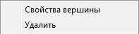
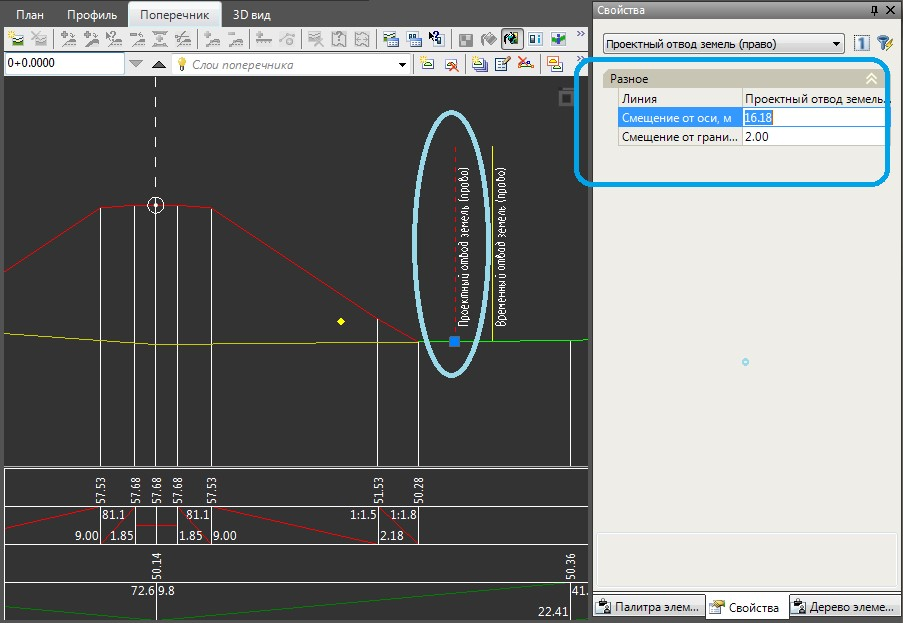

# Визуальное редактирование границ отвода земель

Редактирование границ проектного, временного и существующего отвода земель может осуществляться в рабочих окнах **Плана** и **Поперечников** с помощью мыши.



 Также редактирование линий отвода земель может осуществляться из специального окна Развернутого плана, описание которого будет приведено [ниже](edit_borders_in_window_plan.md).



* Имеется возможность при выделенной линии отвода земель перемещать вершину с помощью левой кнопки мыши.
* При помощи двойного клика мыши в окне План на линии отвода земель добавляется новая вершина.
* При нажатии правой кнопкой мыши на вершине линии отвода земель в окне План откроется контекстное меню:

  

  * **Свойство вершины** - пункт меню для уточнения пикета и смещения данной вершины.
  * **Удалить** - пункт меню для удаления вершины.



 При выделенной вершине отвода земель в окне **Поперечник**, в окне **Свойств** отобразятся параметры данной вершины, которые можно изменить:

 


