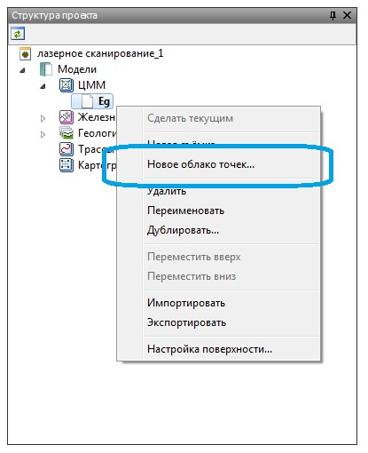

# Импорт данных лазерного сканирования

Для загрузки материалов лазерного сканирования (**Облака точек (\*.las)**), в программу выполните следующие действия:

1. В **Структуре проекта** на модели **ЦММ** нажмите правой кнопкой мыши, в контекстном меню выберите пункт **Новое облако точек**:

   

2. В открывшемся окне выберите файл **(\*.las)** и нажмите **Ок**, облако точек будет загружено в проект, которое отобразится в окне **Плана** и **3D вида**:

   
