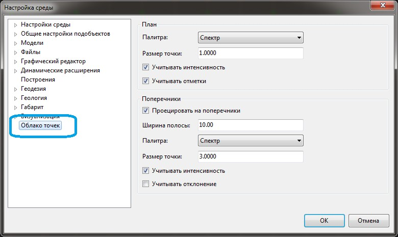
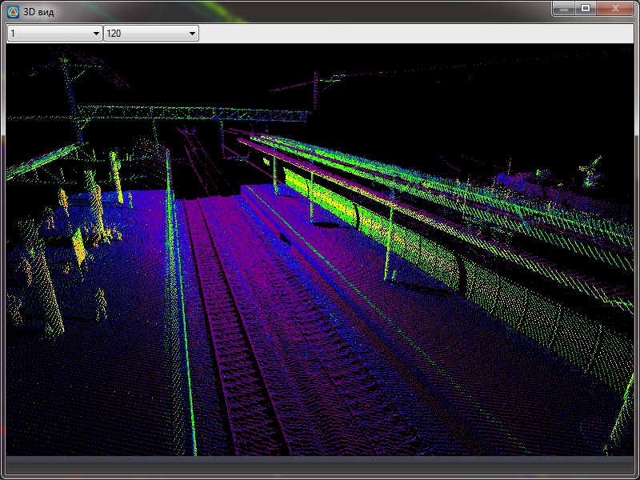
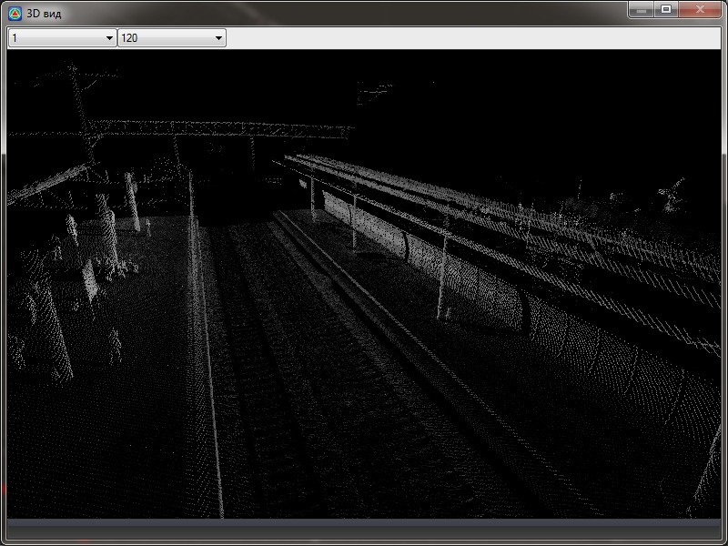
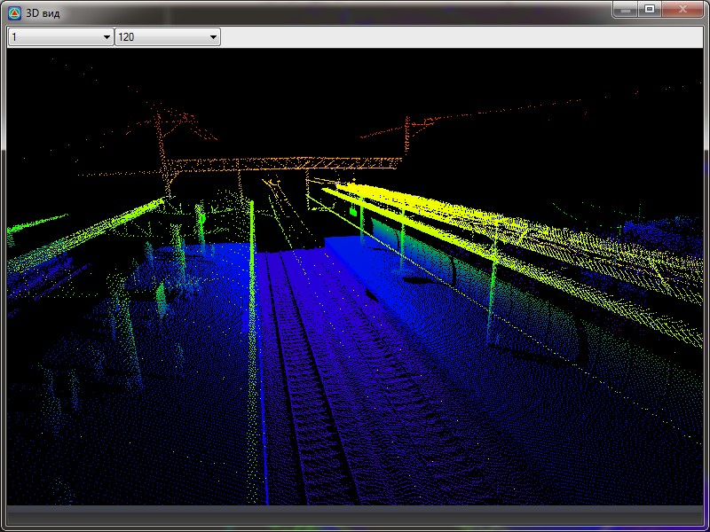
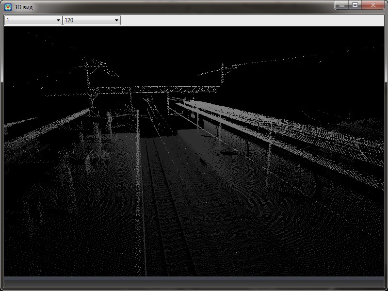

# Настройка отображения облака точек

Имеется возможность настроить параметры отображения облака точек в рабочих окнах программы.

Для этого:

1. Выберите меню **Сервис – Настройка**, выберите вкладку **Облако точек**:

   

   Отображение данных может быть отдельно настроено в рабочих окнах **План** и **Поперечник**.

   **Настройки отображения** в окне **План/3D Вид** (поле **План** окна **Настройка среды**):

   **Размер точки** – поле ввода для задания размера точек.

   **Палитра** – в данном выпадающем списке имеется возможность выбрать два метода отображения данных:

   * Спектр – позволяет отображать данные в виде цветовой палитры.
   * Монохромное – позволяет отобразить данные в виде оттенков серого.
 

   **Учитывать интенсивность** – при производстве съемки, каждой точке в зависимости от ее отражающей способности присваивается некий коэффициент интенсивности, в результате, при включении данной опции, программа присвоит соответствующий цветовой оттенок - если выбрана палитра **Спектр**, или оттенок серого - если выбрана палитра **Монохромное**:

    #|
   |||||
   || Выбрана **Палитра Спектр** | Выбрана **Палитра Монохромное** ||
   |#

   **Учитывать отметки** – в зависимости от высотной отметки (Z) при включении данной опции, программа присвоит соответствующий цветовой оттенок - если выбрана палитра **Спектр** или оттенок серого - если выбрана палитра **Монохромное**:

    #|
   |||||
   || Выбрана **Палитра Спектр** | Выбрана **Палитра Монохромное** ||
   |#

   Настройки отображения в окне **Поперечника** (поле **Поперечник**):

   **Проецировать на поперечники** – включение\выключение отображения облака точек на поперечных разрезах.

   **Ширина полосы** – задается ширина коридора поиска точек лазерного сканирования для проецирования их на текущий поперечник. Ширина полосы задается относительно линии сечения данного поперечного профиля.

   **Учитывать отклонение** – в зависимости от удаленности точки относительно линии сечения текущего поперечника, при включении данной опции, программа присвоит соответствующий цветовой оттенок - если выбрана палитра **Спектр** или оттенок серого - если выбрана палитра **Монохромное**

   

   Опции **Палитра**, **Размер точки** и **Учитывать интенсивность** подробно были описаны выше.

   

2. Задайте необходимые параметры отображения и нажмите **ОК**.
