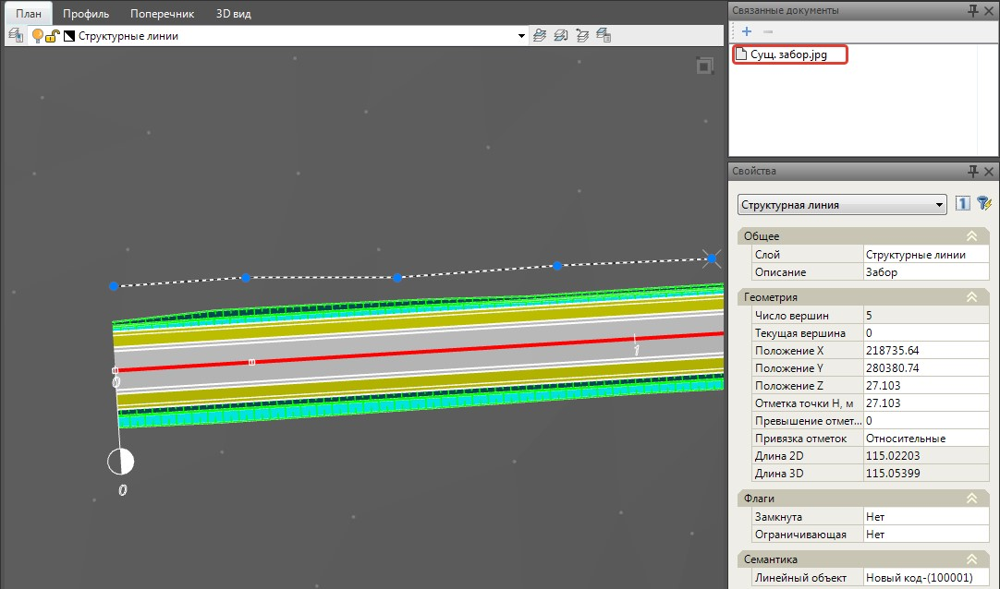

# Добавление связанного документа к элементу ЦММ

Документ может быть привязан непосредственно к объектам поверхности (точке, структурной линии и т.д.).



В данном случае необходимо присвоить элементу поверхности семантический объект ([Назначение объектов семантики для элементов проекта]()), а также этот семантический объект должен обладать соответствующим свойством - **Связанные документы**. **Стандартные объекты** программы имеют это свойство по умолчанию. Для дополнительно добавленных пользовательских объектов это свойство нужно назначить самостоятельно. Механизм назначения дополнительного свойства **Связанные документы** описан в соответствующем разделе ([Создание новых семантических объектов]()).



Чтобы прикрепить **Связанный документ** к элементу **ЦММ**:

1. Выделите элемент в рабочем окне и нажмите на данную кнопку  , расположенную в окне **Связанные документы**.
2. Далее в открывшемся окне выберите необходимый файл из списка и нажмите **Ок**.

В результате в окне **Связанные документы** появится ссылка на существующий файл:

