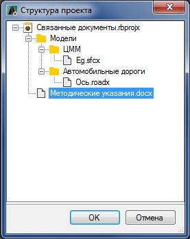
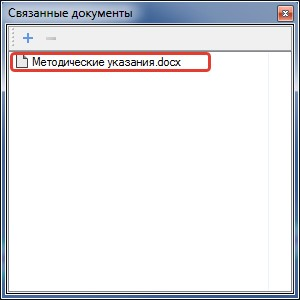

# Добавление связанного документа к модели

Чтобы привязать документ к заданной модели проекта:

1. Откройте окно **Связанные документы** при помощи элемента меню Вид-Связанные документы.
2. Выделите левой кнопкой мыши в окне **Структура проекта** модель, к которой необходимо прикрепить документ. Далее нажмите на кнопку  , расположенную в окне **Связанные документы**.
3. В открывшемся окне выберите необходимый файл из списка и нажмите **Ок**:

   

В результате при выборе соответствующей модели в окне **Структура проекта** или при ее активации в окне **Связанные документы** всегда будет появляться ссылка на существующий файл.



**Чертежи** и **Ведомости**, созданные по какой-либо модели, будут автоматически привязываться к ней и отображаться в окне **Связанные документы**.


