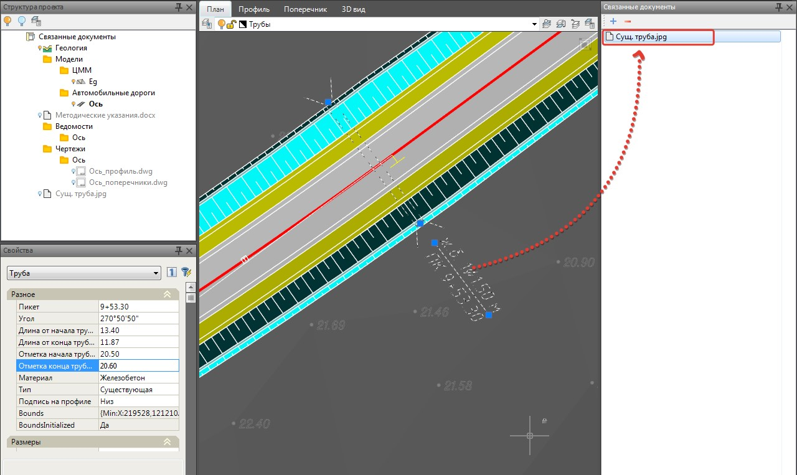

# Добавление связанного документа к объекту

Связанные документы по аналогичному принципу можно добавить и к выбранным объектам модели, например, к водопропускной трубе, геологической выработке и т.д. Для этого:

1. Выделите объект в рабочем окне План.
2. Далее нажмите на кнопку  , расположенную в окне **Связанные документы**.
3. В открывшемся окне выберите необходимый файл из списка и нажмите **Ок**.

В результате при выборе соответствующего элемента в рабочем поле, в окне Связанные документы, всегда будет отражена ссылка на существующий файл:

