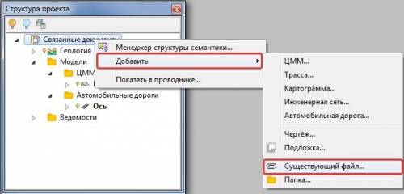

# Подготовка данных

Вышеописанные механизмы работают только с документами, которые подгружены в проект. Файлы документов, создаваемые средствами программного комплекса **Топоматик Robur**, добавляются в проект автоматически, сторонние файлы нужно будет добавить предварительно.

Чтобы добавить необходимый файл в проект:

Щелкните правой кнопкой мыши по соответствующей папке в окне **Структура проекта** и в выпадающем контекстном меню выберите пункт **Добавить-Существующий файл**:

После того, как файл добавлен в **Структуру проекта**, его можно использовать в качестве связанного документа. Подробнее последовательность добавления связных документов описана ниже.
