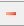

# Удаление связанного документа

Если необходимо удалить ссылку на связанный документ:

1. В окне **Связанные документы** из списка выделите один или несколько файлов.
2. Далее нажмите на данную кнопку , расположенную в окне **Связанные документы**.
