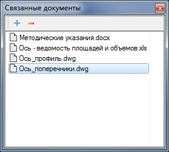
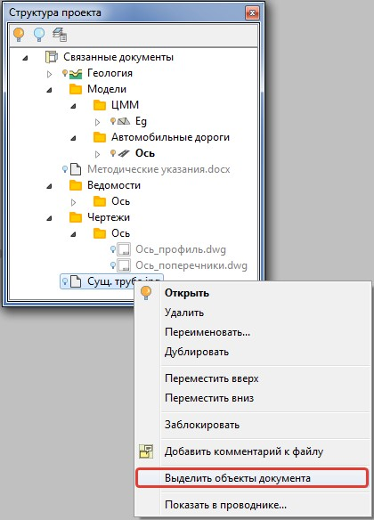

# Особенности работы и дополнительные функции

* В окне **Связные документы** отображаются документы той модели, которая выделена в окне **Структура проекта** или того элемента проекта (точечный, линейный условный знак, труба и т.д.), который выделен в окне **План**.
* Связанный документ можно открыть непосредственно из окна **Связанные документы**. Для этого щелкните по нему два раза левой кнопкой мыши:

  

  

  Если связанный документ имеет сторонний формат, то он будет открыт при помощи соответствующего стороннего ПО (при его наличии).

  

* Имеется возможность быстрого поиска и выделения в рабочем окне **План** объекта на основе связанного с ним документа.

  Для этого:

  Щелкните правой кнопкой мыши в окне **Структура проекта** по документу и в выпадающем меню выберите пункт **Выделить объекты документа**:

  

  Программа выделит соответствующие объекты, отмасштабировав рабочее окно.
