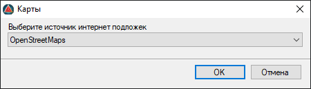
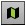
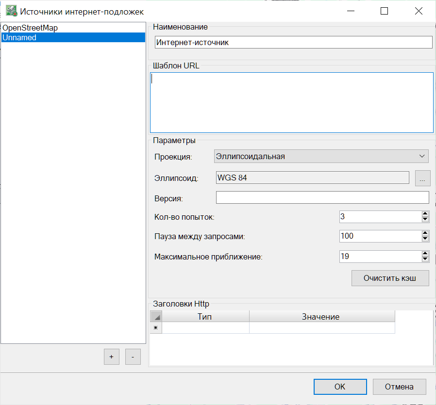

# Интернет-карты

Имеющийся функционал позволяет подгружать карту из настроенного интернет-источника и отображать ее в виде подложки в окне **План**.

## Подключение интернет карты

Для подключения интернет карты:

1. Необходимо назначить Систему координат проекта.



Назначение системы координат проекта описано в соответствующем разделе документации [Работа с системами координат](../coordinate_systems/coordinate_systems.md)



2. Выбрать **Задачи – Карты**. В открывшемся окне из предложенного списка выберите наименование источника:



По умолчанию в программу добавлен источник **OpenStreetMap**. Возможно добавление других интернет источников, см. раздел ниже **Источники интернет карт**



2. Нажмите кнопку **ОК**. В результате, будет производиться подгрузка секторов карты и при увеличении масштаба (прокрутка колесиком мыши) будут подгружаться новые секторы карты более высокого разрешения.



Управление видимостью интернет-карты в окне План осуществляется соответствующей кнопкой , расположенной в нижней части рабочего окна **План** на **Панели управления**. 



## Источники интернет-карт

Имеется возможность добавлять другие источники интернет-карт, для этого:

1. Выберите меню **Задачи** - **Карты** - **Источники интернет-подложек**.

2. В открывшемся окне нажмите кнопку + и заполните необходимые параметры.



Ранее загруженные секторы каждого интернет-источника, которые выбирались в проектах, сохраняются в виде **кэша данных** по пути C:\Users\ *Папка пользователя* \Documents\Топоматик Robur\Settings\Maps в качестве файлов с расширением *\*.idx* и *\*.db*. Таким образом, даже при отсутствии интернет-соединения, ранее загруженные секторы будут отображаться в окне План. Кнопка **Очистить кэш** позволяет удалить все ранее загруженные данные интернет-источника.



3. Нажмите ОК. В результате добавленный интернет-источник будет доступен для выбора.



Источники интернет-карт сохраняются в файл **Maps.db**, располагающийся по пути C:\Users\ *Папка пользователя* \Documents\Топоматик Robur\Settings\Maps.



## Позиционирование интернет карты

При наличии небольшого визуального не соответствия карты с данными проекта:

1. Выберите меню **Задачи – Карта – Выровнять карту по 1 точке/по 2 точкам**, курсор примет форму прицела;

2. Последовательно укажите точку на карте (исходную точку) и соответствующую ей точку на местности (целевую точку). При выборе **Выровнять карту по 2 точкам** дополнительно можно задать поворот карты;

3. В результате положение карты будет скоррректировано.



 Для отмены выше описанных действий выберите меню **Задачи – Карта – Сбросить выравнивание**.



## Извлечь растр

Для сохранения только необходимого участка карты, обведите его цельным контуром, используя примитивы (например прямоугольником, произвольной полилинией и т. д.) и далее:

1. Выберите меню **Задачи - Карты - Извлечь растр**;

2. Укажите отрисованный заранее контур;

3. Выберите масштаб (в данном случае это влияет на качество изображения, а не на его размеры, т. е. чем больше значение, тем выше качество);

4. Дождитесь окончания процесса загрузки растра из сети интернет.



 Извлеченные из интернет карт растры по умолчанию сохраняются в папку проекта в качестве картинок **(\*png)**. 


