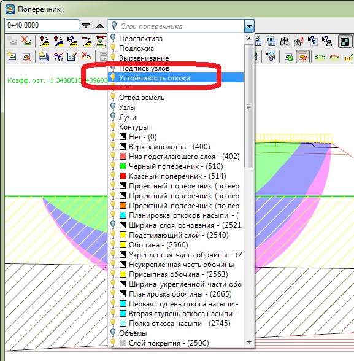

# Включение\отключение данных расчета устойчивости на поперечниках

Так как расчет устойчивости производится и динамически пересчитывается при изменении каких либо параметров поперечника, а также всегда выполняется при перелистывании поперечников, то данный процесс занимает некоторое время, что может сказываться на производительности работы программы.

Для того чтобы процесс расчета устойчивости не выполнялся необходимо в окне **Поперечник** в списке слоев отключить видимость слоя **Устойчивость откосов**:

В итоге видимость результатов и сам процесс динамического расчета будут отключены.

Для того чтобы снова показать или перезапустить расчет устойчивости включите соответствующий слой или откройте окно Исходных данных (меню **Задачи – Устойчивость откосов**) и нажмите **ОК**.
