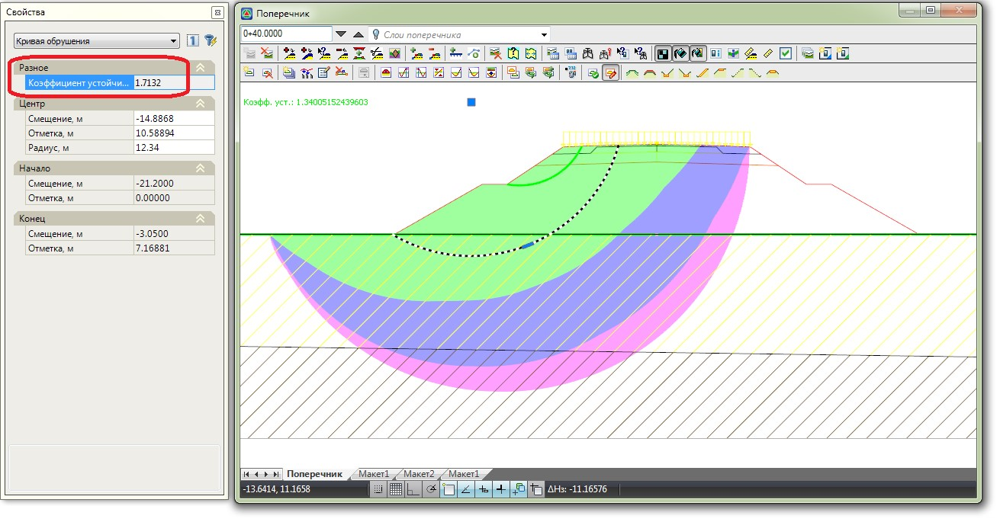

# Ввод произвольной кривой

Данная функция позволяет вручную ввести произвольную кривую скольжения, указав визуально ее центр и радиус. Результатом ввода является отрисовка данной кривой и рассчитанный для нее коэффициент устойчивости.

Для ввода произвольной кривой:

1. Выберите меню **Задачи – Устойчивость откосов – Добавить произвольную кривую**, курсор примет форму прицела.
2. Левой кнопкой мыши укажите центр кривой скольжения и ее радиус:

   

3. В результате построится кривая скольжения, выделив которую в окне **Свойства** можно посмотреть ее характеристики, в частности коэффициент устойчивости:

   

Положение введенной кривой можно редактировать визуально. Для изменения радиуса кривой или положения ее центра - выделите кривую левой кнопкой мыши и переместите соответствующий грипп в требуемое место.

Точное значение параметров кривой скольжения можно задать в окне свойств выбранного объекта. Координаты центра кривой задаются в полях **Смещение и Отметка**, само значение радиуса кривой задается в одноименном поле.
