# Задание исходных данных и выполнение расчета

Исходными данными для оценки устойчивости откосов являются:

* Проектная линия поперечного профиля.

  

  Коды узлов поперечника используются для определения границы расчета устойчивости и положения равномерно распределенной нагрузки, например, от воздействия автотранспорта.

  

* Геологические данные: грунты c их расчетными характеристиками.
* Также могут быть заданы слои дорожной конструкции, в качестве дополнительной нагрузки, армирующие прослойки из геосинтетического материала, линия УГВ и т.д.

Для задания всех необходимых параметров и выполнения оценки устойчивости:

Выберите меню **Задачи – Устойчивость откосов – Исходные данные**, откроется диалоговое окно, состоящее из нескольких вкладок:

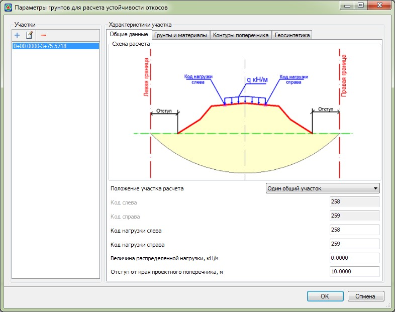

Далее рассмотрим основные вкладки данного окна.

## Поле Участки

В левой части окна задаются пикетажные участки, для которых назначаются все исходные данные расчета (данные по нагрузке, характеристики грунтов и дополнительных материалов).



 При первичном открытии данного окна будет задан только один пикетажный участок (от начала и до конца трассы). Таким образом, изначально, расчет устойчивости выполняется на всю трассу с неизменными в пределах нее характеристиками грунтов и нагрузок.



С помощью соответствующих кнопок имеется возможность добавить, изменить или удалить участки: 

Ряд опции для участков доступен через контекстное меню, для этого нажмите правой кнопкой мыши на участке:

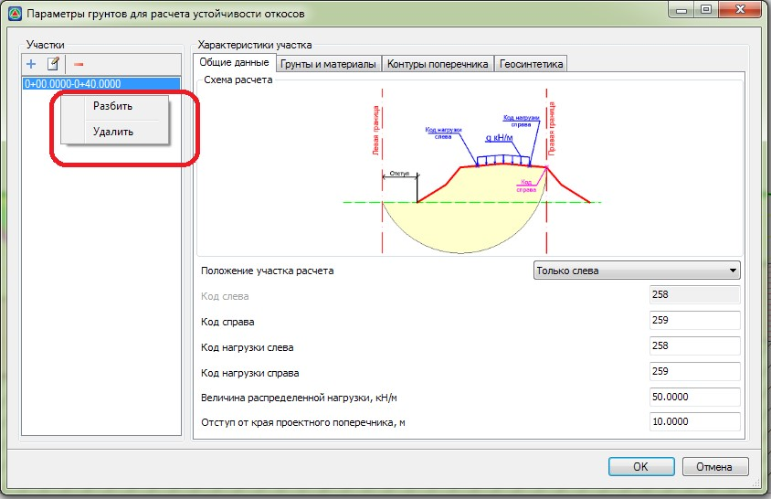

Опция **Разбить** позволяет разделить по середине один пикетажный участок на два.
Опция **Удалить**, позволяет удалить данный участок.



1. Участков может быть добавлено не ограниченное количество.
2. Набор параметров и характеристик, которые задаются на вкладках данного окна (**Общие данные, Грунты и материалы** и т.д.) соответствуют выделенному участку, т.е. для каждого участка могут быть заданы свои расчетные параметры и характеристики.



## Вкладка Общие данные

На данной вкладке задаются параметры, которые определяют границы расчета устойчивости на поперечниках, а также расположение и величина распределенной нагрузки:

В выпадающем списке **Положение участка** расчета выбирается один из вариантов определения расчетного участка на поперечниках, на которых будет производиться оценка устойчивости.

В зависимости от выбранной опции, в верхней части данного окна будет отображаться схема, на которой, для наглядности, показан участок расчета и все задаваемые параметры.

Для более точного расчета устойчивости только правой или только левой части поперечника выберите положение участка **Только справа** или **Только слева** соответственно.

Для более точного расчета устойчивости одновременно и левой и правой части поперечника выберите положение участка **Слева и справа вместе**.

В отличие от участка расчета **Слева и справа вместе**, выбор схемы **Один общий участок** позволяет более быстро произвести оценку устойчивости одновременно и левой и правой части поперечника, но с меньшей точностью.

В полях **Код слева\ Код справа** задаются коды узлов проектного поперечника, для назначения границ оценки устойчивости.



При выборе схемы расчета **Один общий участок** данные коды не задаются.



 В полях **Код нагрузки слева\ Код нагрузки справа** задаются коды узлов проектного поперечника, для определения положения распределенной нагрузки. Также, в соответствующем поле задается ее величина, в кН/м.



1. В качестве распределенной нагрузки, как правило, принимается нагрузка от автотранспорта или других искусственных сооружений.
2. По умолчанию, в качестве ее границ, заданы коды 258 и 259 (левая и правая бровка соответственно).
3. Для Железнодорожной конфигурации программы по умолчанию заданные коды отличны.



В поле **Отступ от края проектного поперечника** задается расстояние, которое отсчитывается от границ проектного поперечника (одинаковое слева и справа) и определяет крайние границы участка расчета устойчивости откосов.

## Вкладка Грунты и материалы

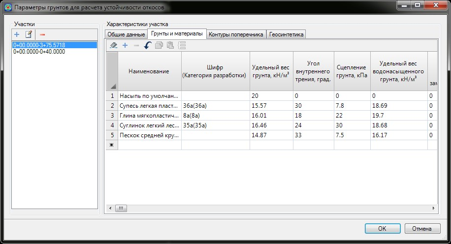

На данной вкладке содержится список грунтов всей трассы, с их расчетными характеристиками (**Удельный вес, Угол внутреннего трения и Сцепление**), включая эти же характеристики в водонасыщенном состоянии.



Заданные характеристики грунтов в водонасыщенном состоянии учитываются для тех грунтов, которые находятся ниже введенной линии уровня грунтовых вод (УГВ):

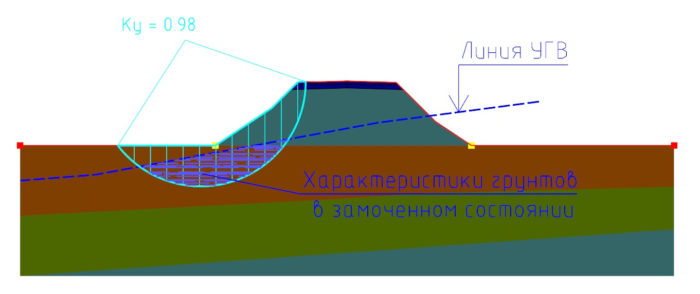 



Данный список грунтов и их характеристики заполняется автоматически, по таблице грунтов текущего подобъекта, при первичном открытии данного окна, а также при добавлении нового пикетажного **Участка**.

Для открытия таблицы **Грунтов** на текущем подобъекте и изменения или задания расчетных характеристик:

1. Выберите меню **Задачи – Геология – Грунты**, в открывшемся окне выделите грунт и нажмите на панели соответствующую кнопку  :

   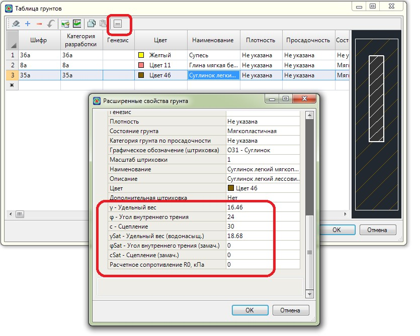

   

   Сделанные изменения характеристик грунтов в данной таблице будут учитываться только в текущем подобъекте и при первичном открытии окна задания **Исходных данных**, а также при добавлении нового пикетажного **Участка**.

   

2 Для того чтобы каждый раз в новом проекте или на трассе не задавать расчетные характеристики грунтов в таблице текущего подобъекта (см. выше п.1), характеристики могут быть заданы в **Библиотеке шаблонов грунтов**, для ее открытия выберите меню **Сервис – Библиотека шаблонов грунтов**:

   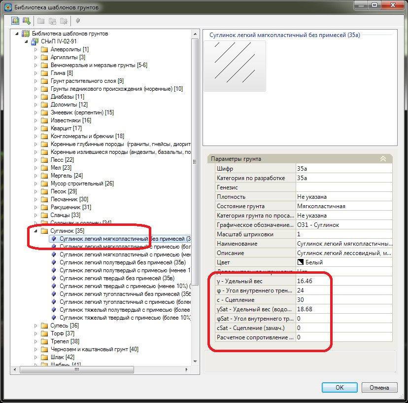

   

   **Библиотека шаблонов грунтов** является общей для всех проектов.

   

   Список по умолчанию добавленных наименований грунтов, а также их расчетные характеристики при необходимости могут быть изменены.

   Для добавления или удаления элементов используются соответствующие кнопки на панели данного окна: 

   При необходимости обновления в данной таблице характеристик грунтов, в случае изменения геологических данных, а также назначения характеристик для нового добавленного элемента, в соответствии с таблицей грунтов текущего подобъекта:
   
   1. Щелкните левой кнопкой мыши в столбце **Шифр** необходимого грунта и нажмите соответствующую кнопку .
   2. В открывшемся окне таблицы выберите грунт, характеристики которого должны быть присвоены.

   Грунт с наименованием **Насыпь**, по умолчанию автоматически добавляется в общий список грунтов, для упрощения дальнейшего задания исходных данных. В частности, на вкладке **Контуры поперечника**, грунт **Насыпь** автоматически назначается в соответствии с рядом кодов объемов поперечника.

   

   Подробное описание вкладки **Контуры поперечника** см. ниже.

   

## Вкладка Контуры поперечника

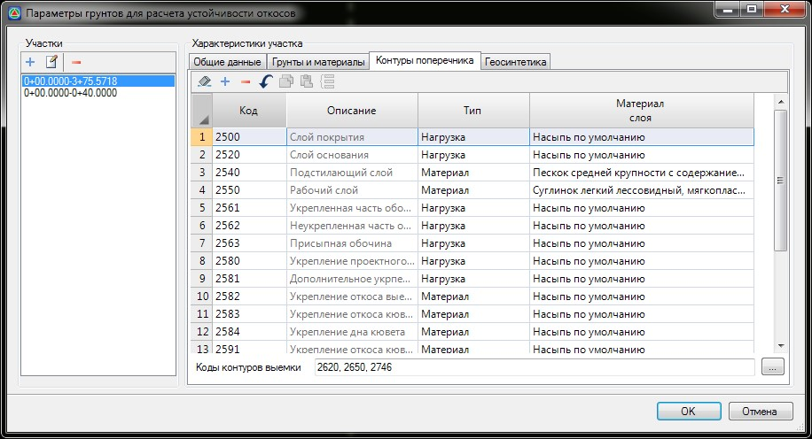

Данная вкладка содержит список всех стандартных кодов объемов (конструкция **Объем**), которые могут присутствовать на поперечниках.



В случае если стандартный шаблон конструкции поперечника был доработан, т.е. были добавлены пользовательские элементы (дополнительные коды **Объемов**), то с помощью соответствующей кнопки **+,** расположенной на панели данного окна, имеется возможность добавить строку с новым кодом объема и назначить ему необходимые параметры.



Каждый контур объема поперечника, в зависимости от выбранной опции в столбце **Тип**, может быть учтен при расчете устойчивости откосов, либо в качестве нагрузки, либо в качестве материала.

В случае, если для кода объема поперечника выбран тип – **Нагрузка**, то данный контур в расчете устойчивости будет учитываться как распределенная нагрузка. Величина нагрузки будет равна площади этого контура на поперечнике, умноженная на удельный вес соответствующего грунта, который назначается в столбце **Материал слоя**.

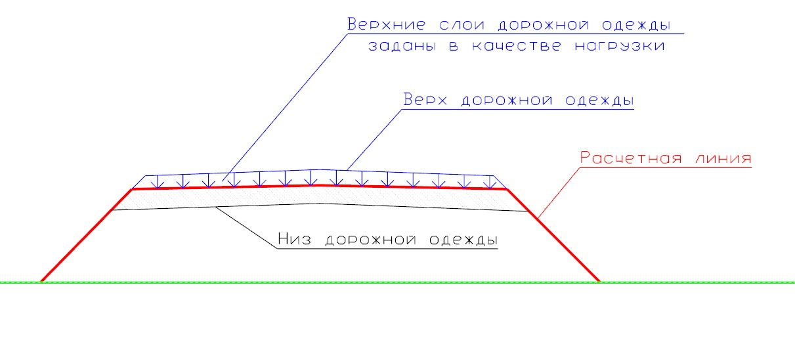



 Как правило, такой тип может назначаться для верхних конструктивных слоев дорожной одежды.



В случае, если для кода объема поперечника выбран тип – **Материал**, то данный контур в расчете устойчивости будет учитываться именно как массив грунта, в котором производиться подсчет соотношения сдвигающих и удерживающих сил.

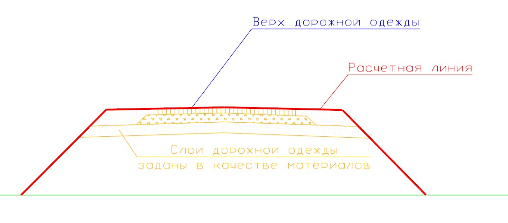

В поле **Коды контуров выемки** задаются номера кодов, которые при расчете устойчивости должны быть исключены.

## Вкладка Геосинтетика

При расчете устойчивости могут учитываться геосинтетические прослойки. На данной вкладке задаются их расчетные характеристики: 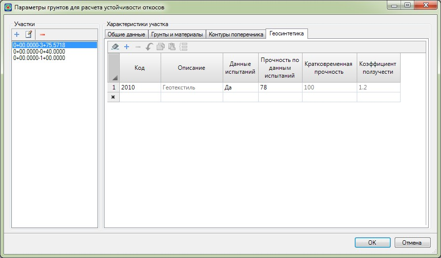



На данный момент учет геосинтетических материалов в расчете реализован только в Автодорожной конфигурации программы согласно методике ОДМ 218.5.003-2010.



Армирующие прослойки учитываются в зависимости от значения прочности, которое может быть определено по данным испытаний (в поле **Данные испытаний установлен признак -Да**), и задано числовым значением в соответствующем столбце (**Прочность по данным испытаний**), или рассчитана исходя из заданной кратковременной прочности и коэффициента ползучести, (согласно ОДМ 218.5.003 -2010, форм 8.1):

$$R_{pp}^T = \frac{R_p⋅A_1⋅A_2⋅A_3⋅A_4}{y_p}$$

где:

* **А1** – коэффициент учета ползучести (коэффициент перехода от прочности на растяжение к длительной прочности), принимаемый по разделу 8 б или по гарантированным производителем данным, отраженным в технической документации.
* **А2** – коэффициент учета повреждения материала при транспортировке, монтаже и уплотнении грунта, принимаемый равным 0,95.
* **А3** – коэффициент учета стыковки, взаимного перекрытия и соединения полотен геосинтетического материала, принимаемый равным 0,8.
* **А4** – коэффициент учета влияния окружающей среды, принимаемый равным 0,9; γb – коэффициент запаса для материала, принимаемый равным 1,25.

При расчете устойчивости, армирующие прослойки учитываются в каждой точке пересечения с кривой скольжения, т.е. в данных точках рассчитываются удерживающие силы (исходя из значения прочности армирующей прослой и направления вектора), сумма которых добавляется к удерживающим моментам:

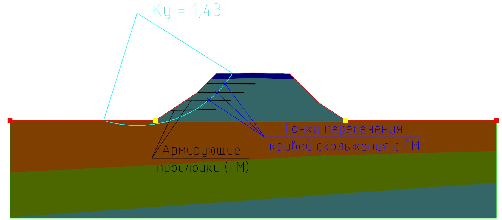

Задав на вкладках окна **Исходные данные** все необходимые характеристики нажмите **ОК**, в результате в окне **Поперечник** отобразится результат расчета устойчивости:

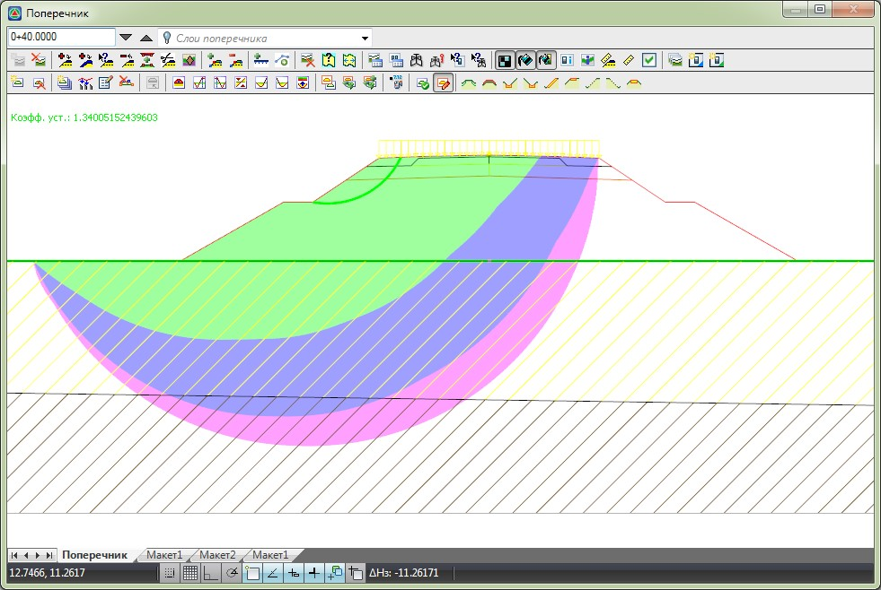

В качестве заливки отображены зоны различных значений коэффициентов устойчивости, показана критическая кривая скольжения и соответствующее ей значение коэффициента устойчивости, в верхнем левом углу данного окна.



1. В случае если коэффициент устойчивости не обеспечен (т.е. меньше минимально допустимого значения, заданного в настройках расчета), то кривая и значение коэффициента устойчивости рисуется красным цветом.
2. Подробное описание настроек см. [ниже](settings_calculation.md).


