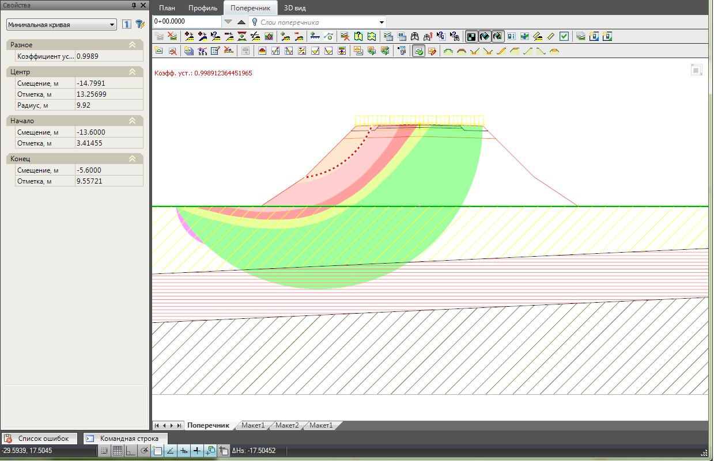

# Общие данные

Данный блок задач позволяет выполнять оценку устойчивости откосов земляного полотна.

К его отличительной особенности следует отнести, то что все расчеты выполняются непосредственно в текущем проекте **Robur**. Это существенно сокращает процесс задания исходных данных, т.к. все необходимые характеристики (параметры поперечного профиля, характеристики грунтов и т.п.) могут приниматься на основе данных проекта.

Оценка устойчивости производится динамически, в связи с этим, полностью исключается возможность появления несоответствий с расчетом, при изменении исходных или проектных данных. Быстро и наглядно выполняется анализ вариантов переконструирования поперечных профилей, если требуемое значение коэффициента устойчивости не обеспечено.

На данный момент, расчет выполняется по методу **Феллениуса**, который заключаются в построении теоретических кривых обрушения откоса и подсчете соотношения сдвигающих и удерживающих сил, т.е. нахождение минимального коэффициента устойчивости.

Общая расчетная схема представлена ниже:

1. Верхняя граница расчета (проектная линия поперечника).
2. Кривая скольжения (обрушения) грунта.
3. Уровень грунтовых вод.
4. (bi) – ширина плоского элемента (сектора), на которые разбивается массив грунта и в каждом из которых рассчитывается соотношение сдвигающих и удерживающих сил.
5. (1:m) – заложение откоса.

При оценке устойчивости откосов, в программе, имеется возможность учитывать:

* Воздействия равномерно распределенных нагрузок.
* Верхние слои дорожной конструкции, в качестве дополнительной нагрузки.
* Сейсмическое воздействие.
* Наличие армирующих прослоек из геосинтетических материалов, в соответствии с выбранной расчетной методик.

Результаты расчета отображаются в окне поперечник, в качестве заливки заданных диапазонов коэффициентов устойчивости и критической кривой обрушения, с отображением значения минимального коэффициента устойчивости:

Выходной отчет может быть создан как для текущего поперечного профиля, так и для заданного участка трассы.
