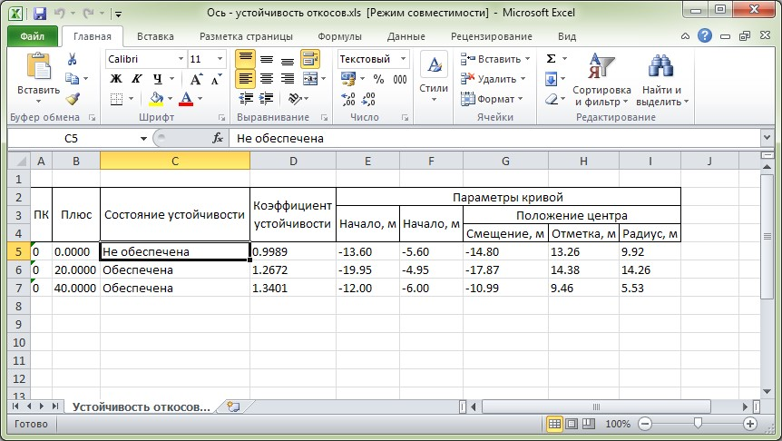
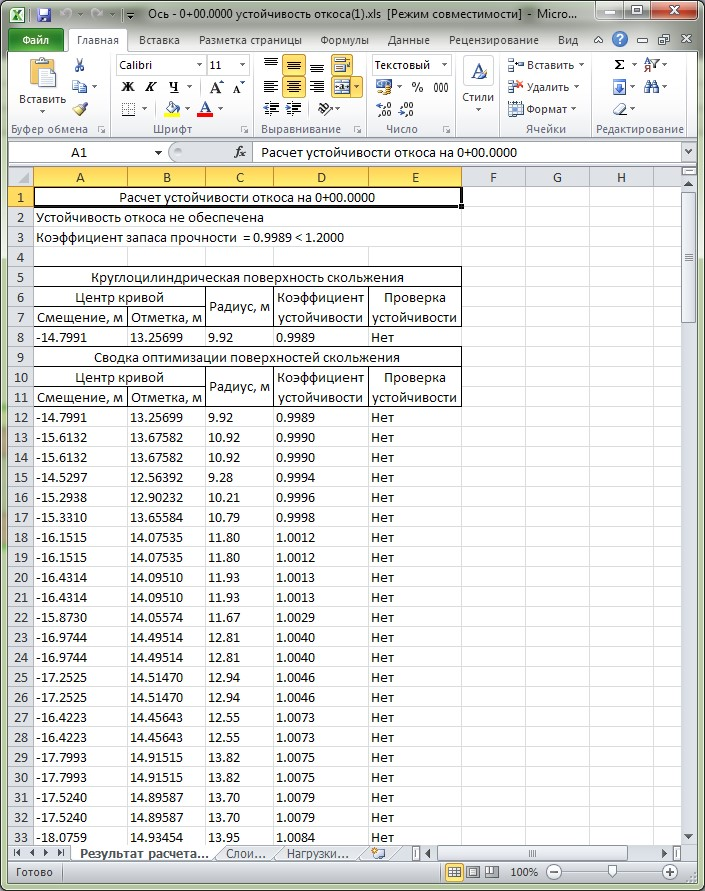
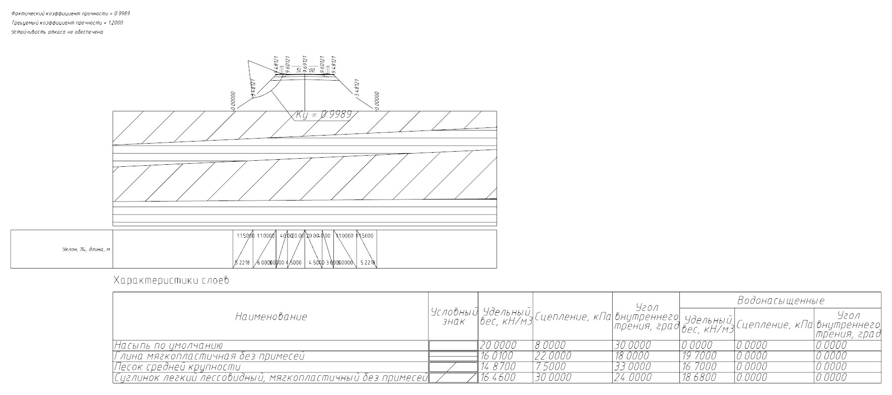

# Выходные данные

В качестве выходных данных имеется возможность сформировать **Общую** и **Детальную ведомость**.

**Общая ведомость** создается, как правило, на группу поперечников, расположенных на заданном участке и содержит итоговую информацию по параметрам построенных кривых обрушения, а также информацию по обеспечению (не обеспечению) устойчивости откосов.



Процесс создания данной ведомости, в зависимости от количества поперечников на выбранном участке может занимать определенное время:



**Детальная ведомость** создается по текущему поперечнику и содержит подробную информацию по произведенному расчету устойчивости. Т.е. включает в себя параметры большинства просчитанных кривых обрушения, выводит таблицу характеристик грунтов и распределенных нагрузок.

При создании **Детальной ведомости** также формируется схематический чертеж:

