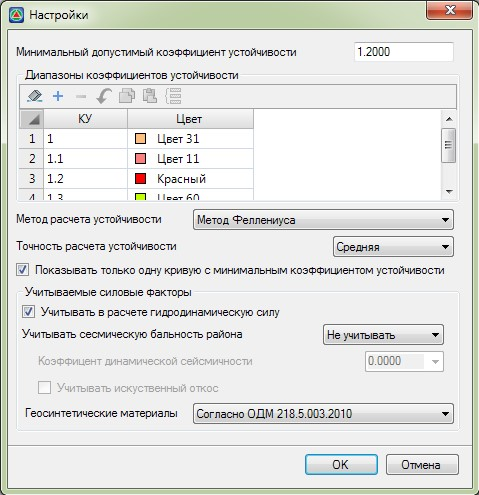

# Настройки расчета

Для задания различных настроек расчета и отображения:

1. Выберите меню **Задачи – Устойчивость откосов – Настройки расчета**, откроется диалоговое окно:

   

В поле **Минимальный допустимый коэффициент устойчивости** задается его числовое значение, которое сравнивается с фактическим. В случае если рассчитанный минимальный коэффициент устойчивости получился меньше или равный данному значению, то выходные данные в окне поперечник (минимальная кривая и коэффициент устойчивости) будут показаны красным цветом, иначе зеленым.

В таблице **Диапазоны коэффициентов устойчивости** задаются границы интервалов коэффициентов устойчивости, до которых будет отрисовываться заливка. Данная таблица является редактируемой, т.е. с помощью соответствующих кнопок на панели  имеется возможность добавлять\ удалять диапазоны коэффициентов устойчивости, а также задавать им цвет.

В селекторе **Метод расчета устойчивости** выбирается метод оценки устойчивости откосов.



На данный момент реализован расчет устойчивости по методу **Феллениуса**.



Выбор точности расчета в соответствующем селекторе влияет на точность и скорость расчета.



Изменение точности влияет на количество рассчитываемых кривых обрушения.



При расчете устойчивости может оказаться, что кривых обрушения с минимальным коэффициентом устойчивости, в пределах точности (три знака после запятой), будет несколько. В случае, если опция **Показывать только одну кривую с минимальным коэффициентом устойчивости** включена, то из всех кривых будет показана только одна.

В выпадающем списке **Геосинтетические материалы** выбирается один из вариантов учета армирующих прослоек из геосинтетических материалов.



На данный момент имеется возможность либо не учитывать армирующие прослойки, либо учитывать согласно ОДМ 218.5.003-2010. Способы задания характеристик прослоек были подробно описаны [ранее](enter_initial_data.md).



Включение опции **Гидродинамическая сила** позволяет учесть силу воздействия потока воды, которое оказывает влияние на устойчивость откосов. Значение гидродинамической силы определяется исходя из веса воды и угла, относительно линии УГВ

Включение опции **Сейсмическое воздействие**, позволяет учитывать сейсмическую силу, которая определяется исходя из веса и грунта и коэффициента динамической сейсмичности, который принимается в зависимости от бальности района проектирования, либо задается самостоятельно.



 1. Коэффициент динамической сейсмичности принимается согласно таблице ниже:

     | Расчетная сейсмичность в баллах | 1-5 | 6 | 7 | 8 | 9 | 10 |
     | --- | --- | --- | --- | --- | --- | --- |
     | **Коэффициент динамической сейсмичности** | 0,00 | 0,01 | 0,025 | 0,05 | 0,10 | 0,25 |

2. При оценке устойчивости искусственных склонов (откосов, насыпей, дамб, выемок, бортов карьеров и др.) значения коэффициента сейсмичности увеличивают в 1,5 раза, для этого включается соответствующая опция.


