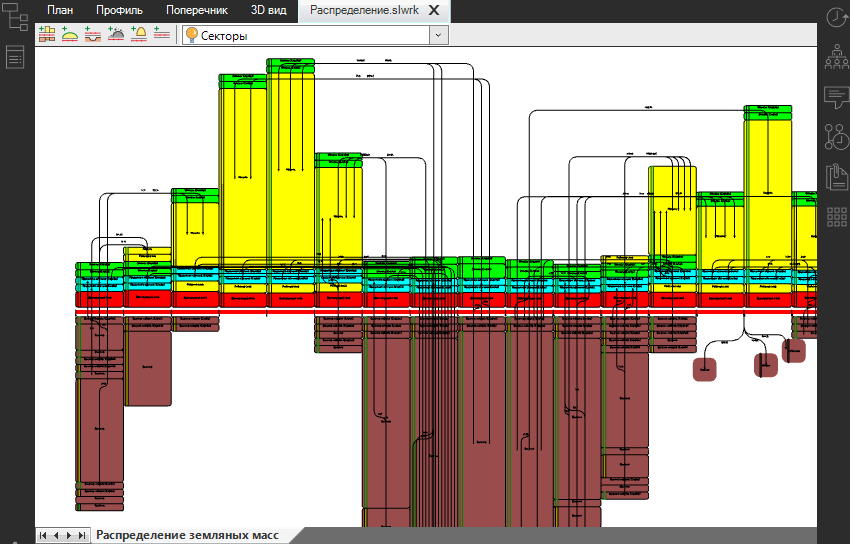

# Автоматическое распределение материалов

Данный функционал решает транспортную задачу, распределяя объемы от **Поставщика** к **Потребителю**, учитывая применимости и приоритет материалов (см. раздел [Предварительные настройки модели](../pre_settings_model/general_information.md)). Оптимальное решение данной задачи сводится к минимизации стоимости перевозок, которая в свою очередь зависит от дальности перемещения грунтов. Таким образом, минимизация дальности возки требуемого объема – основной критерий, который реализован в автоматическом алгоритме решения транспортной задачи.

Автоматическое распределение материалов в программе реализовано двумя методами:

* **Метод Фогеля** – это один из стандартных способов решения транспортной задачи. Он позволяет найти приближенное значение оптимального решения задачи распределения и перемещения материалов. Наиболее быстрый метод, но наименее точный.

* **Симплекс – метод** - относится к универсальным методам, обеспечивающим максимально эффективное решение задачи, но гораздо более продолжительное время.

Последовательность распределения материалов в этих двух методах аналогична и заключается в следующем:

1. В первую очередь программа распределяет объемы материалов между Секторами диаграммы, учитывая **Применимость материала**, его приоритет и **Применимость Потребителя**.
2. Далее программа смотрит наличие лишнего материала в Секторах диаграммы, если такой имеется, то он будет распределен в **Отвалы**.
3. На следующем этапе программа смотрит наличие недостающего материала в Секторах типа **Потребитель**, если такой имеется, то он будет привезен из **Карьеров**.
4. На заключительном этапе идет распределение материалов по **Свалкам** и **Кавальерам**.



На каждом этапе распределения материалов программа анализирует возможные пути перемещения материалов и принимает наиболее короткий путь.



Автоматическое распределение можно делать как на всём линейном объекте распределения, так и на выделенной группе линейного объекта. Для этого:

1. С помощью секущей рамки выделите весь линейный объект распределения или его часть.
2. На ленте **Распределения земляных масс** нажмите кнопку  (**Метод Фогеля**) или  (**Симплекс -метод**).

В результате в рабочем поле отобразятся стрелки перемещения материалов, и индикаторы наличия материалов изменят цвет.

